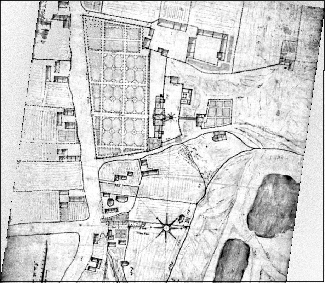
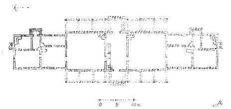
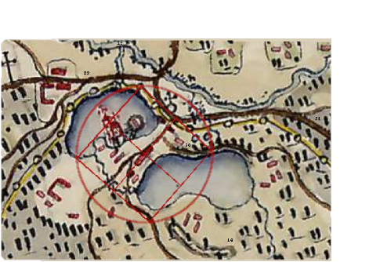
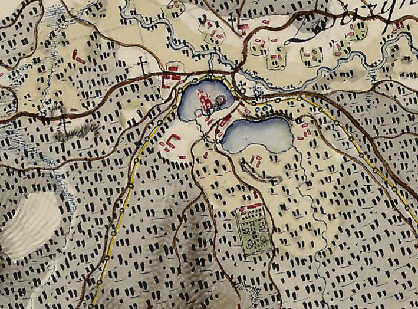
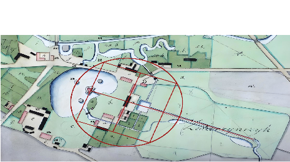

Kartografia stanowi jeden z najważniejszych filarów rekonstrukcji [założenia villowego](/zwierzyncopedia/dziedzictwo/architektura/willa-zamoyskich/) w Zwierzyńcu. Wobec braku zachowanych planów budowlanych z XVI wieku, to mapy późniejsze — wojskowe, pomiarowe i inwentarzowe — pozwalają odczytać geometryczny kod pierwotnego układu renesansowego.

## Plan willi ujazdowskiej — A. Albertini, 1606

Najważniejszy *dowód analogiczny* w studium nad zwierzyniecką villą. Plan sporządzony przez A. Albertiniego w 1606 r. przedstawia królewską drewnianą willę Anny Jagiellonki w Ujazdowie pod Warszawą — rezydencję, którą [Jan Zamoyski](/zwierzyncopedia/ludzie/jan-zamoyski/) prawdopodobnie poznał osobiście podczas wesela z Krystyną Radziwiłłówną 12 stycznia 1578 roku.[^1]

Plan ukazuje kompletny układ villowy: centralny budynek o wymiarach ok. 60×12 m z gankiem kolumnowym, sienią przelotową, apartamentami i kaplicą na piętrze, a ponadto ogrody kwaterowe *all'italiana*, sadzawki, kanały z mostkiem i rozległy oparkaniony zwierzyniec z altaną. Wg hipotezy prof. J. Putkowskiej, architektem willi ujazdowskiej był [Bernardo Morando](/zwierzyncopedia/ludzie/bernardo-morando/) — ten sam, którego Zamoyski zatrudnił na dożywotnim kontrakcie w 1579 r.[^2]

Rzut przyziemia willi ujazdowskiej służy jako klucz do odczytania inwentarzy zwierzynieckich — porównanie wymiarów, układu pomieszczeń i programu funkcjonalnego pozwala na rekonstrukcję modrzewiowej willi Zamoyskich.

## Mapa józefińska — Friedrich von Mieg, 1779–1783

Pierwsza mapa dokumentująca układ przestrzenny Zwierzyńca. Sporządzona przez austriackiego oficera ppłk. Friedricha von Miega w ramach wielkiej akcji skartografowania Galicji dla Habsburgów (tzw. zdjęcie józefińskie).[^3]

Na mapie widoczne są:

- drewniany budynek centralny (*willa*) pomiędzy dwoma akwenami
- staw z wyspami (na centralnej wyspie — kościół pw. św. Jana Nepomucena)
- zabudowania gospodarcze po obu stronach willi
- droga dojazdowa po grobli

Mapa posiada istotne niedokładności liniowe i kątowe, co było konsekwencją jej wojskowego przeznaczenia. Niemniej potwierdza istnienie elementów znanych z wcześniejszych źródeł pisanych: centralnego budynku, systemu stawów i ogrodzonego zwierzyńca. Badacze zwracają uwagę na tzw. *suchy kanał* — starorzecze będące świadkiem wcześniejszego układu wodnego — jako przykład dowodu z retrospekcji kartograficznej.[^4]

## Mapa pomiarowa Ordynacji Zamojskiej, 1829–1830

Najsilniejszy wizualny argument w całym studium nad villą. Geometryczna mapa pomiarowa Zwierzyńca, sporządzona na zlecenie XII ordynata Stanisława Kostki Zamoyskiego, zarejestrowała układ przestrzenny osady z bezprecedensową dokładnością.[^5]

Na mapie czytelne są:

- **centralna modrzewiowa willa** pomiędzy dwiema symetrycznymi oficynami drewnianymi
- **cztery murowane oficyny klasycystyczne** wzniesione w 1793 r. przez XI ordynata
- **oś villowa** i **mediana ogrodów kwaterowych** z kopcem widokowym na ich przecięciu
- **staw villowy** przed podjazdem i **staw z czterema wyspami**
- **grobla dojazdowa** z mostem i systemem zastawek
- **zwierzyńczyk** (teren z oswojonymi zwierzętami)
- **długi kanał** wzdłuż grobli dojazdowej
- **zabudowania gospodarcze**, budynek wrotnych, oranżeria

Wyraźna osiowość, symetria oficyn i regularny podział przestrzeni to — wg Lucyny Matławskiej-Patyk i Michała Patyka — *dispositio* zaplanowanego projektu renesansowego, zarejestrowanego przez mierniczych ponad 230 lat po jego powstaniu. Autorzy studium *Villa Restituta* (2025) określają tę mapę jako „ostateczny zapis przetrwania kodu geometrycznego — odcisk fantomowy pierwotnego planu, którego regularność trudno wytłumaczyć organicznym narastaniem".[^6]

Jest to jednocześnie **ostatni dokument kartograficzny potwierdzający istnienie modrzewiowej willi.** Na kolejnej znanej mapie — z 1842 roku — willi już nie ma.

## Plan gruntów i lasów, 1842

Sporządzony za XIII ordynata Konstantego Zamoyskiego, który powierzył Zarząd Ordynacji bratu Andrzejowi Arturowi (ok. 1842–1863). Na planie widoczne są cztery oficyny murowane, ale **puste miejsce pomiędzy nimi** — modrzewiowa willa zniknęła bez śladu. Jest to pierwszy dokument kartograficzny bez centralnego budynku założenia.[^7]

Na mapie pojawiają się za to nowe elementy osady urzędniczej: browar, *Willa Plenipotentówka*, murowane i nowe drewniane domy urzędnicze.

## Plan stawu i nizin — L. Dorant, 1872

Plan sporządzony „do wiedzy Rządcy Klucza Zwierzynieckiego" przez L. Doranta dokumentuje szczegółowo układ wodny osady za XIV ordynata Tomasza Franciszka Zamoyskiego. Odnotowuje kopiec widokowy — relikt ogrodów kwaterowych — oraz oficynę nadbudowaną piętrem, zwaną odtąd *Pałacem Administracji Ordynacji Zamojskiej*.[^8]

## Współczesna kartografia

W Miejscowym Planie Zagospodarowania Przestrzennego Zwierzyńca istnieje zapis o zabytkowym układzie przestrzennym wpisanym do rejestru „A" zabytków nieruchomych województwa lubelskiego (nr A/1304), obejmujący „część układu przestrzennego miejscowości w granicach zakreślonych wg załączonego planu, wraz z oznaczoną na planie zabudową, zadrzewieniem, wodami, ciągami komunikacyjnymi i ukształtowaniem krajobrazu terenu".[^9]

W Systemie Informacji Przestrzennej Narodowego Instytutu Dziedzictwa zaznaczono obszar zabytkowy wraz z obiektami historycznymi związanymi z osadą urzędniczą Ordynacji Zamojskiej.

---

## Zobacz też

- [Willa Zamoyskich](/zwierzyncopedia/dziedzictwo/architektura/willa-zamoyskich/) — centralny budynek założenia villowego
- [Dokumenty źródłowe](/zwierzyncopedia/biblioteka/dokumenty-zrodlowe/) — inwentarze, korespondencja, diariusze
- [Osie widokowe](/zwierzyncopedia/dziedzictwo/uklad-urbanistyczny/osie-widokowe/) — geometria kompozycji *ad quadratum*
- [System wodny](/zwierzyncopedia/dziedzictwo/uklad-urbanistyczny/system-wodny/) — stawy, kanały, groble

[^1]: L. Matławska-Patyk, M. Patyk, *Villa Restituta w Zwierzyńcu — studium*, Zwierzyniec 2025, rozdz. I.4.
[^2]: J. Putkowska, *Rezydencja w Ujazdowie w II połowie XVI i w XVII w.*, Kwartalnik Architektury i Urbanistyki 1977, z. 2, s. 95.
[^3]: *Galicja na józefińskiej mapie topograficznej 1779–1783*, Tom 8, Część A.
[^4]: L. Matławska-Patyk, M. Patyk, *Villa Restituta…*, rozdz. VIII.3.
[^5]: Mapa pomiarowa Zwierzyńca, 1829/1830 (AOZ — Plany 314).
[^6]: L. Matławska-Patyk, M. Patyk, *Villa Restituta…*, rozdz. VIII.4.
[^7]: AOZ — 71. *Inwentarz materiałów kartograficznych. Plan gruntów i lasów do wsi Zwierzyniec należących*, r. 1842, sygn. 403.
[^8]: AP Lublin — *Plan stawu, stawiska, nizin, sadzawek w Zwierzyńcu. Do wiedzy Rządcy Klucza Zwierzynieckiego.* L. Dorant, 1872 r.
[^9]: Miejscowy Plan Zagospodarowania Przestrzennego Zwierzyńca, zapis o zabytku nr A/1304.
