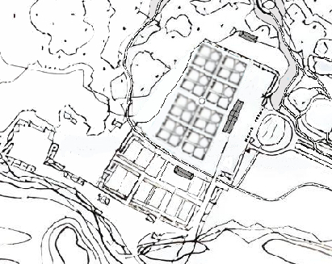

import Infobox from '../../../../components/Infobox.astro';

<Infobox
  image="architektura/dziedziniec-willowy.jpg"
  alt="Dziedziniec dawnego założenia willowego w Zwierzyńcu z gmachem Zarządu i oficyną."
  caption="Wnętrze willowe — widok na gmach Zarządu i oficynę. Fot. M. J. Patyk."
  data={[
    { label: "Nazwa", value: "Willa Zamoyskich (<em>Villa Zwierzyniec</em>)" },
    { label: "Lokalizacja", value: "Zwierzyniec, woj. lubelskie" },
    { label: "Data budowy", value: "ok. 1593 – przed 1597" },
    { label: "Styl", value: "Renesans włoski <em>in modo polacco</em>" },
    { label: "Fundator", value: '<a href="/zwierzyncopedia/ludzie/jan-zamoyski/">Jan Zamoyski</a> (I ordynat)' },
    { label: "Architekt", value: '<a href="/zwierzyncopedia/ludzie/bernardo-morando/">Bernardo Morando</a> (?)' },
    { label: "Status", value: "Nie istnieje (po ok. 1833)" },
  ]}
/>

**Willa Zamoyskich** (łac. *villa*) — renesansowe założenie rezydencjonalne w Zwierzyńcu, wzniesione z inicjatywy kanclerza i hetmana wielkiego koronnego Jana Saryusza Zamoyskiego po 1593 roku. Było to kompleksowo zaplanowane *założenie villowe* (*dispositio*), obejmujące centralną modrzewiową willę, ogrody kwaterowe, układy wodne, zwierzyńczyk i oparkaniony zwierzyniec, rozplanowane według renesansowych zasad geometrycznych *ad quadratum*. Przez ponad 250 lat stanowiło wiejską rezydencję szesnastu kolejnych ordynatów zamojskich.

*Encyklopedia Powszechna* Orgelbranda z 1863 roku odnotowała:

> *Zwierzyniec — wieś Ordynacji Zamojskiej…, o trzy mile od Zamościa odległy, sławny domem zamieszkanym nieraz przez ordynatów od najdawniejszych czasów.*[^1]

## Geneza — od Padwy przez Ujazdów do Zwierzyńca

Założenie villowe w Zwierzyńcu nie było dziełem przypadku, lecz realizacją głęboko przemyślanej wizji Jana Zamoyskiego — jednej z najwybitniejszych osobowości polskiego Odrodzenia. Fundator, absolwent i rektor Uniwersytetu w Padwie (1563), podczas studiów bezpośrednio obcował z kulturą *villeggiatury* w regionie Veneto, gdzie renesansowe *ville* przeżywały swój największy rozkwit. To doświadczenie — połączone z humanistyczną edukacją i osobistą erudycją — ukształtowało w nim pragnienie przeniesienia włoskiego ideału *la villa ideale* na grunt polski.[^2]

Bezpośrednim wzorcem stała się królewska willa Anny Jagiellonki w Ujazdowie pod Warszawą, wzniesiona ok. 1573 roku z drewna modrzewiowego. Znana z precyzyjnego planu inwentaryzacyjnego Aleksandra Albertiniego (1606), obejmowała ona okazały piętrowy budynek, trzy ogrody *all'italiana*, sadzawki, kanał z mostkiem oraz rozległy, ogrodzony zwierzyniec z altaną myśliwską pośrodku.[^3]

Zamoyski poznał willę ujazdowską osobiście — 12 stycznia 1578 roku odbyło się tam jego wesele z Krystyną Radziwiłłówną, uświetnione prapremierą *Odprawy posłów greckich* Jana Kochanowskiego przed majestatem króla Stefana Batorego i królowej Anny Jagiellonki. Do realizacji zamysłu potrzebował architekta — i szybko go pozyskał. Już w 1578 roku zatrudnił Bernardo Morando, włoskiego architekta padewskiego pochodzenia, którego według hipotezy profesor Jolanty Putkowskiej łączyć można z projektem willi ujazdowskiej. W 1579 roku Zamoyski związał Moranda dożywotnim kontraktem.[^4]

Sekwencja zdarzeń pozwala odtworzyć logikę fundatora:

- **1578** — wesele w królewskiej willi Anny Jagiellonki; bezpośrednie doświadczenie wzorcowego polskiego *założenia villowego*
- **1578** — natychmiastowe zatrudnienie domniemanego twórcy willi ujazdowskiej
- **1579** — zabezpieczenie wyłącznych usług architekta dożywotnim kontraktem
- **1589** — ustanowienie Ordynacji Zamojskiej
- **1593** — zakup włości szczebrzeskiej — terenu pod przyszłą villę
- **przed 1597** — willa ukończona i funkcjonująca

Datę ukończenia willi pozwala ustalić list Jana Zamoyskiego datowany *z Zwierzyńca 28 octobris 1597*, w którym pisał do księcia Krzysztofa Radziwiłła:

> *Skarżę się WMści, że mi dziś jeden [łoś] rozigrał się i pędząc z góry szyję złamał.*[^5]

List ten jest niepodważalnym dowodem (*terminus ante quem*), że przed tą datą wzniesiono nie tylko budynek, ale całe założenie było na tyle ukończone i wyposażone, że mogło gościć kanclerza wraz z dworem.

## Lokacja — wybór miejsca i kompozycja

Jan Zamoyski na założenie villowe wybrał lekkie wzniesienie piaszczystego *plateau* na lewym brzegu rzeki Wieprz, w rozległej pradolinie okolonej wzgórzami: Bukową Górą, Kamienną Górą, Obrocką Górą i Folwarczną Górą. Położenie w terenie naturalnie niedostępnym przez rozlewiska i bagna zapewniało bezpieczeństwo — podobnie jak Duża i Mała Zalewa broniły Zamościa.[^6]

Według hipotetycznej rekonstrukcji Lucyny Matławskiej-Patyk i Michała Patyka, na teren nałożono renesansowy model geometryczny: krzyż grecki zorientowany *„pięć na trzynastą"* (30° na wschód od osi północ–południe, co zapewniało optymalne nasłonecznienie i przewietrzanie), kwadrat jako pole gruntu (miara liniowa) i koło widnokręgu krajobrazowego (miara kątowa). Była to ta sama zasada kompozycyjna, którą Jerzy Kowalczyk wykazał w odniesieniu do planu Zamościa.[^7]

Centralna kompozycja oparta została na dwóch przecinających się osiach:

- **oś główna architektury** — prostopadła do grzbietu wydmowego
- **mediana ogrodowa** — oś ogrodów kwaterowych, łącząca willę z odległymi ogrodami na Bukowej Górze duktem leśnym

Otoczenie krajobrazowe — dno doliny zamknięte wzgórzami — powiązano osiami widokowymi, tworząc wnętrze architektoniczno-krajobrazowe o wyjątkowych walorach.[^8]

## Budynek — modrzewiowa willa

Centralnym elementem założenia była okazała willa wzniesiona z drewna modrzewiowego, o wymiarach ok. 60 × 12 metrów — zbliżonych do królewskiej willi ujazdowskiej. Najstarszy i najważniejszy jej opis pochodzi z inwentarza klucza zwierzynieckiego sporządzonego w 1732 roku:

> *Z przyjazdu brama z drzewa tartego w węgły zbudowana pod gontami, na wierzchu dwa herby żelazne, pod bramą mostek z dylów, budynek stary pod gontami nowopobity z drzewa tartego, pod którym ganek na ośmiu słupach, na którym kaplica etc., etc… Idąc przez wschody na górę drzwi na górze do sali przed kaplicą. Na dole dwie piwnice murowane.*[^9]

Na podstawie inwentarzy z 1732 i 1800 roku oraz analogii z planem willi ujazdowskiej Albertiniego (1606) można odtworzyć rozkład budynku:

### Parter

- **ganek na ośmiu słupach** — wejście frontowe (jak w Ujazdowie)
- **obszerna sień** ze schodami na piętro — reprezentacyjna, przelotowa, wiążąca obie symetryczne części willi
- **sala stołowa** — ok. 10 × 10 m, z długim sosnowym stołem pośrodku i trzema stołami we framugach okien; mogła pomieścić ok. 50 osób. Maria Kazimiera Zamoyska w liście wspominała, że starosta radomski Podlodowski *„wszedł do pokoju zwanego stołowa izba"*[^10]
- **sala balowa** — ze świecznikami z czeskiego szkła i *„dwoma lustrami pomiędzy oknami"*[^11]
- po obu stronach sieni: dwie duże sale po trzy okna od podjazdu i trzy od ogrodu (jak w Ujazdowie)
- **apartamenty** — w każdym skrzydle: pokój (*anticamera*), gabinet (*gabinetto*), sypialnia z alkową (*camera*, *alcove*), izba z łazienką (*bagno*), komórka ustępowa w szczycie
- **schody boczne** w skrzydłach — umożliwiające dyskretne poruszanie się z pominięciem sieni

### Piano nobile (piętro)

- **kaplica** — potwierdzona wieloma źródłami: inwentarz 1732, listy Marii Kazimiery (*„Byłam w tym czasie na mszy"*[^12]), diariusz Bazylego Rudomicza odnotowujący udzielanie sakramentu małżeństwa[^13]
- **sala reprezentacyjna** przed kaplicą

Udzielanie sakramentów w prywatnej kaplicy wymagało zezwolenia ordynariusza diecezji i było przywilejem najwyższych rodów — cecha głównej siedziby rodowej, nie utylitarnego dworku.

### Piwnice

- **dwie piwnice murowane** — potencjalny dowód materialny *in situ*, możliwy do weryfikacji archeologicznej

## Wnętrza — obraz z inwentarza 1800 roku

Inwentarz sporządzony na polecenie XI ordynata Aleksandra Augusta pozwala niemal „rozejrzeć się" po komnatach willi. Oprócz sal stołowej i balowej, w budynku znajdowały się:[^14]

- **pokój paradny** — kanapy, krzesła, stoliki, komoda, fortepian, zegary, popiersie Jana Jakuba, antyczne figury
- **pokój bawialny** — stoliki do gier towarzyskich, alabastrowe wazony, marmurowy kominek, kopersztychy w pozłacanych ramkach
- **pokój bilardowy** — z angielskimi sztychami
- **dwa pokoje biblioteczne** — osiem wysokich szaf, dwa globusy z mapami i planetami, dwa atlasy oprawne w skórę, globus zodiakalny
- **pokój sypialny** — z rzeźbami

Ten wykwintny program pomieszczeń — sala balowa, biblioteka z atlasami i globusami, pokój bilardowy — wskazuje na centrum życia towarzyskiego i intelektualnego, realizujące humanistyczny ideał łączenia wypoczynku (*otium*) z pożyteczną działalnością (*negotium*).

## Elementy założenia villowego

### Oficyny i dziedzińce

Willę otaczały dwie symetryczne drewniane oficyny, odsunięte na znaczną odległość. Trzy dziedzińce pełniły różne funkcje:

- **dziedziniec podjazdowy** — od frontu, ze stawem villowym otoczonym lipami
- **dziedziniec ogrodowy** — pomiędzy oficynami, otwarty na błonia rzeki
- **dziedziniec gospodarczy** — na uboczu, z zabudowaniami: stajnie, psiarnie, kurniki, chlewnie[^15]

Do willi prowadził gościniec po grobli, zakończony mostkiem na kanale i bramą z dwoma żelaznymi herbami.

### Ogrody

Centralna kompozycja ogrodowa oparta była na przecinających się osiach z medianą ogrodu kwaterowego *ad quadratum*. Przez stulecia ogrody rozbudowywano:

- w kierunku oparkanionego zwierzyńca i Bukowej Góry
- wzdłuż kanału przy grobli dojazdowej (*ogrody Marysieńki*)
- ku nadwieprzańskim błoniom ze stawem z czterema wyspami i ermitażem
- nad rzeką Wieprz (*sentymentalne ogrody Zofii Zamoyskiej*)

I ordynat zatrudniał fachowych ogrodników — w dokumentach odnotowano *„Ambrożego Hortulana"* pielęgnującego ogrody ordynata.[^16] Za IX ordynata Jana Jakuba pracował wieloletni ogrodnik Jan Ziomka (1761–1792) z trzema pomocnikami, otrzymujący znaczną pensję 864 złotych rocznie, z dwoma ogrodami — ozdobnym i kuchennym, każdy otoczony 100-przęsłowym płotem, z oranżerią i inspektami.[^17]

Ogrodowy kopiec widokowy wzniesiony pośród ozdobnych kwater istniał jeszcze w 1872 roku.[^18]

### Zwierzyńczyk

Wydzielona wodami część ogrodu, w której trzymano łagodne zwierzęta: sarny, zające, króliki, ozdobne ptactwo (pawie, łabędzie, kaczki), a w stawach ryby. Na mapie pomiarowej z lat 1829/30 widnieje napis *Zwierzyńczyk* w tym miejscu.[^19]

### Zwierzyniec

Oparkaniony zwierzyniec miał 4 mile (ok. 30 km) obwodu i był dozorowany przez opłacanych *parkanowych*, którzy naprawiali ogrodzenie. Jan Zamoyski zatrudnił leśniczego Marcina Jesiotrowskiego (zwanego zawiadowcą zwierzyńca) co najmniej od 1596 roku.[^20]

Ulryk Werdum, tajny wywiadowca w służbie Francji, po wizycie w 1670 roku opisał:

> *Tym razem pojechaliśmy w lesie inną drogą, przez zwierzyniec (Serennitz) księżnej na Zamościu (...), mający cztery mile w obwodzie. Jest on otoczony wysokim płotem, a w nim trzymają różne zwierzęta, jak: jelenie, sarny, dziki, łosie.*[^21]

Użycie terminu *Serennitz* — nawiązującego do *Serenissimy* Republiki Weneckiej i kolebki renesansowych *villi* — jest znaczące: wykształcony obserwator klasyfikował tym samym zwierzynieckie założenie w najwyższej kategorii europejskich rezydencji.[^22]

## Życie w willi — świadectwa z epoki

Willa od początku funkcjonowała jako pełnoprawna rezydencja, nie sezonowy dworek myśliwski. Świadczą o tym liczne źródła.

### Wizyty królewskie

- **1634** — II ordynat Tomasz przyjmował króla Władysława IV wracającego ze Lwowa po układach z Turkami[^23]
- **1660** — III ordynat Jan II *Sobiepan* podejmował parę królewską — Jana II Kazimierza i Ludwikę Marię z Gonzagów
- **1662** — para królewska ponownie w Zwierzyńcu; dworzanie *„za radą jm. pana chorążego Bracławskiego pojechali do Zwierzyńca, gdzie przebywa j.ośw."*, jak odnotował Bazyli Rudomicz[^24]
- **1663** — *Sobiepan* podejmował w Zwierzyńcu Stanisława Herakliusza Lubomirskiego i księcia Michała Korybuta Wiśniowieckiego
- **1671** — Gryzelda Wiśniowiecka gościła syna, króla Michała, z żoną Eleonorą Habsburżanką[^25]

### Codzienność dworu

Jan II Zamoyski *Sobiepan* z upodobaniem spędzał wiele dni w Zwierzyńcu — pisał stąd liczne listy, pełnił urząd, przyjmował interesantów i rektora Akademii Zamojskiej. Bazyli Rudomicz w swoim *Diariuszu* wielokrotnie odnotowywał wizyty:

> *Rok pański 1661, maj, 3. Byliśmy w Zwierzyńcu u j.ośw. zapraszając go na uroczysty akt promocji doktorskiej w dniu 9 obecnego miesiąca. Obiecał przyjechać na tę uroczystość.*[^26]

Po pożarze Zamościa 19 kwietnia 1658 roku dwór Zamoyskich przeniósł się do Zwierzyńca, które stało się główną siedzibą rodu.

### Marysieńka — najsłynniejsza mieszkanka

Maria Kazimiera d'Arquien, żona *Sobiepana* (1658–1665), rozbudowała założenie o elementy renesansu francuskiego. W swej korespondencji konsekwentnie używała wyrażenia *du parc* (*z parku*) — terminu oznaczającego formalne, zakomponowane założenie krajobrazowe najwyższej kategorii, nie zwykły las czy ogród.[^27]

Jan Sobieski wspominał po latach:

> *Jakoś Waszmość była wesoła za nieboszczyka (...). Jako potem w Zamościu i we Zwierzyńcu ustawiczna dobra myśl i maszkaryje, i gry różne, to w karty, to w ciuciubabki, to „au petit jeu", to przechadzki, to milion inszych zabaw.*[^28]

## Ewolucja — architektoniczny palimpsest

Historia założenia po śmierci fundatora jest opowieścią o niezwykłej ciągłości. Przez ponad dwa stulecia kolejni ordynaci nie tylko dbali o substancję renesansowej willi, ale rozwijali ją, dodając nowe warstwy stylowe, które jednak nigdy nie zatarły oryginalnego planu. Zwierzyniec stanowi swoisty architektoniczny palimpsest:

| Okres | Ordynat | Maniera stylowa | Kluczowe realizacje |
|-------|---------|-----------------|---------------------|
| ok. 1593 | I — Jan Zamoyski | Renesans włoski *in modo polacco* | Modrzewiowa willa, ogrody kwaterowe, zwierzyniec, układ wodny |
| ok. 1658 | III — Jan II *Sobiepan* i Marysieńka | Renesans francuski | Staw z 4 wyspami, ermitaż, długi kanał, grobla Marysieńki |
| 1741–1747 | VII — Tomasz Antoni | Barok włoski | Kościół *na wodzie* wg Il Gesu, kwatery ogrodowe |
| ok. 1772 | IX — Jan Jakub | Klasycyzm | Generalny remont willi, rozbudowa ogrodów, oranżeria |
| 1793–1800 | XI — Aleksander August | Maniera sentymentalna | Cztery murowane oficyny klasycystyczne, park z kanałami i mostkami, chiński mostek |
| ok. 1804 | XII — Zofia Czartoryska | Romantyzm angielski | Ogrody swobodne, sarkofag na wyspie, złamane kolumny, aleja Marysieńki |
| po 1831 | XIII — Konstanty | Osada urzędnicza | Likwidacja willi, przebudowa oficyn na administrację i zakłady |

XI ordynat Aleksander August, wznosząc cztery murowane oficyny (prawdopodobnie wg projektu Ferdynanda Merksena, 1793), *„z sentymentem potraktował wiekową willę, zachował ją z uwagi na starożytność"* — nowe otoczenie, które stworzył, podkreślało dostojność tego domu pełnego pamiątek i żywej tradycji.[^29]

## Zanik i pamięć

Ostatnia wzmianka o willi pochodzi z 20 września 1833 roku.[^30] Na mapie pomiarowej z lat 1829/30 widnieje jeszcze budynek modrzewiowej willi w centrum założenia — jest to ostatni dokument kartograficzny potwierdzający jej istnienie. Na planie gruntów z 1842 roku willi już nie ma. Legendarny dom Jana Zamoyskiego przetrwał jedynie we fragmentarycznym opisie z inwentarza 1732 roku, odnotowanym przez archiwistę Mikołaja Stworzyńskiego, oraz w inwentarzu pałacowym z 1800 roku.[^31]

XVI ordynat Jan Tomasz Zamoyski (1912–2002) przekazał ważną informację: w latach dwudziestych XX wieku, podczas niwelacji terenu po wykrotach drzew pomiędzy budynkami istniejących do dziś murowanych oficyn, natrafiono na szczątki belek modrzewiowych — pozostałości fundamentów dawnej willi. Informacja ta wymaga weryfikacji archeologicznej.[^32]

Do dziś przetrwały cztery murowane oficyny klasycystyczne z końca XVIII wieku, stanowiące jedyne zachowane budynki pierwotnego zespołu rezydencjonalnego. Teren willi nie był dotąd przedmiotem badań archeologicznych — a z perspektywy potwierdzenia rekonstrukcji założenia villowego ma on wyjątkowe znaczenie.

## Historiografia

Pierwszą naukową analizę zwierzynieckiego założenia zawierała praca magisterska Haliny Matławskiej (1970), zamieszczona w studium konserwatorskim PP PKZ pod redakcją K. Majewskiego. Badaczka początkowo przyjęła termin *„dworek myśliwski"*, jednak w wyniku wieloletnich kwerend archiwalnych — inwentarzy, rachunków, korespondencji, map — skorygowała datowanie o pół wieku i dokonała porównania z willą ujazdowską. To ona zainicjowała prace nad odtworzeniem renesansowego układu villowego i *„odczytała w Zwierzyńcu renesansowy wzorzec programowy villi włoskiej"*.[^33]

Lucyna Matławska-Patyk i Michał Patyk w studium *Villa Restituta w Zwierzyńcu* (2025) rozwinęli tę argumentację, proponując hipotetyczną rekonstrukcję pierwotnego modelu *villi idealnej* i dowodząc, że Zwierzyniec zasługuje na status Pomnika Historii.[^34]

---

[^1]: *Encyklopedia Powszechna* S. Orgelbranda, t. XXVIII, Warszawa 1868, hasło *Zwierzyniec*.
[^2]: L. Matławska-Patyk, M. Patyk, *Villa Restituta w Zwierzyńcu. Studium*, Zwierzyniec 2025, cz. II.
[^3]: G. Ciołek, *Ogród w Ujazdowie*, oprac. na podst. planu A. Albertiniego z 1606 r.; J. Putkowska o autorstwie Moranda.
[^4]: Villa Restituta, cz. II.4 — hipoteza J. Putkowskiej; kontrakt dożywotni z 1579 r.
[^5]: AGAD, Archiwum Zamoyskich, list Jana Zamoyskiego do Krzysztofa Radziwiłła, 28 X 1597, za: Villa Restituta.
[^6]: Villa Restituta, cz. III.1.
[^7]: Villa Restituta, cz. III.1; J. Kowalczyk, *Ideologiczne aspekty urbanistyki Zamościa*.
[^8]: Villa Restituta, cz. III.1 — hipotetyczna rekonstrukcja, oprac. L. Matławska-Patyk, M. Patyk.
[^9]: Inwentarz klucza zwierzynieckiego z 1732 r., za: M. Stworzyński; Villa Restituta.
[^10]: List Marii Kazimiery Zamoyskiej, za: Villa Restituta, cz. IV.
[^11]: Inwentarz z 1800 r., za: Villa Restituta.
[^12]: List Marii Kazimiery Zamoyskiej, za: Villa Restituta.
[^13]: B. Rudomicz, *Efemeros, czyli Diariusz prywatny pisany w Zamościu w latach 1650–1672*, wpisy z 21 V 1656 i 28 I 1663.
[^14]: Inwentarz mebli i sprzętu w pałacu i oficynach zwierzynieckich, 1800 r., za: Villa Restituta.
[^15]: Villa Restituta, cz. III.3.1.
[^16]: Rachunki dworskie I ordynata, za: Villa Restituta.
[^17]: Villa Restituta, cz. IV (IX ordynat).
[^18]: AP Lublin, Plan stawu, stawiska, nizin, sadzawek w Zwierzyńcu, L. Dorant, 1872 r.
[^19]: AOZ-314, Mapa pomiarowa Zwierzyńca, r. 1829–1830.
[^20]: Rachunki: *„Płace. 1 czerwca wypłacono ze skarbu (...) Jesiotrowski, który zwierzyńcem zarządzał otrzymał 27"*, za: Villa Restituta.
[^21]: U. Werdum, *Dziennik podróży 1670–1672*, za: Villa Restituta.
[^22]: Villa Restituta — analiza terminologii Werduma: *Serennitz* jako nawiązanie do *la Serenissima*.
[^23]: Villa Restituta, cz. IV (II ordynat).
[^24]: B. Rudomicz, *Efemeros*, wpis z 21 IX 1662.
[^25]: B. Rudomicz, *Efemeros*, wpis z 27 IX 1671.
[^26]: B. Rudomicz, *Efemeros*, wpis z 3 V 1661.
[^27]: Villa Restituta, cz. IV — analiza terminologii *du parc*.
[^28]: List Jana Sobieskiego, za: Villa Restituta.
[^29]: Villa Restituta, cz. IV (XI ordynat).
[^30]: Ostatni znany dokument o willi datowany na 20 IX 1833 r., za: Villa Restituta.
[^31]: Inwentarz 1732 r. (M. Stworzyński) i inwentarz 1800 r.
[^32]: Relacja XVI ordynata Jana Tomasza Zamoyskiego, za: Villa Restituta.
[^33]: H. Matławska, praca magisterska 1970; studia konserwatorskie PP PKZ, red. K. Majewski, 1979.
[^34]: L. Matławska-Patyk, M. Patyk, *Villa Restituta w Zwierzyńcu. Studium*, Zwierzyniec 2025.
