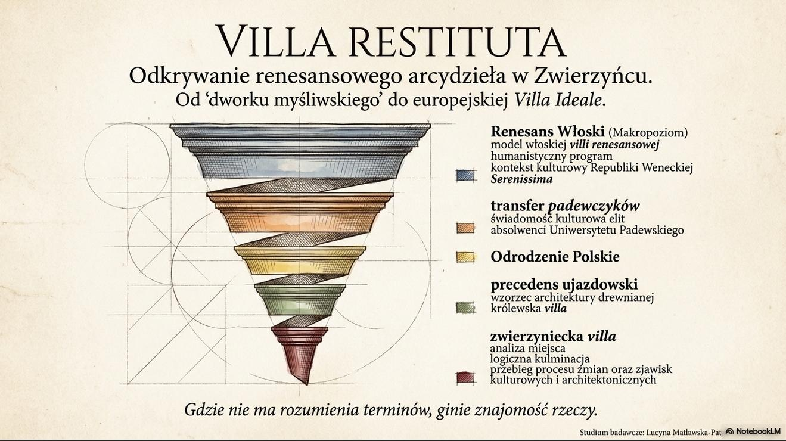
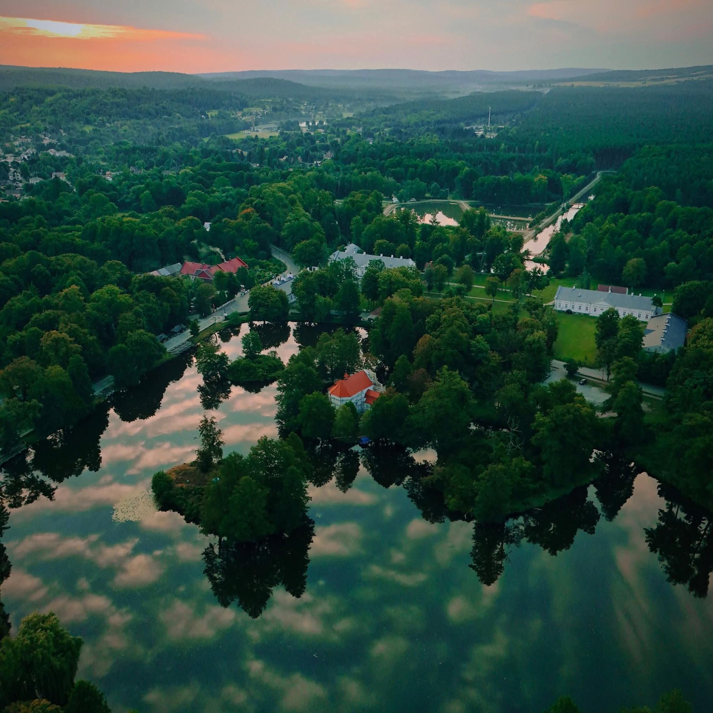

Zwierzyniec to unikalne **miasto-ogród**, którego historyczny układ przestrzenny jest świadectwem wielowiekowej tradycji urbanistycznej Ordynacji Zamojskiej. W tej sekcji dokumentujemy materialny dorobek architektury i planowania przestrzennego.

## Sekcje

- **[Układ urbanistyczny](/zwierzyncopedia/dziedzictwo/uklad-urbanistyczny/)** – osie widokowe, system wodny, planowanie przestrzenne
- **[Architektura](/zwierzyncopedia/dziedzictwo/architektura/)** – Willa Zamoyskich, Zarząd Ordynacji, Kościół na Wodzie
- **[Palimpsest — ewolucja założenia](/zwierzyncopedia/dziedzictwo/palimpsest/)** – pięć stuleci narastania warstw stylowych
- **[Pomnik Historii — argumentacja](/zwierzyncopedia/dziedzictwo/pomnik-historii/)** – dlaczego Zwierzyniec zasługuje na uznanie

