**Układ villowy wchodzi już w piąte stulecie.** Na pierwotnej kanwie *la villa ideale in modo italiano* — tj. na świadomych założeniach estetycznych — kształtowano kolejne maniery stylowe: renesans francuski, barok włoski, klasycyzm oświecenia i formy projektowe dla rezydencjonalno-urzędniczej osady-ogrodu. Zwierzyniec nigdy nie był posiadłością marginalną, lecz cenioną i stale rozwijaną siedzibą rodową.[^1]

Pojęcie **palimpsestu** — pergaminu, z którego zeskrobano dawny tekst, by napisać nowy, przy czym ślady pierwotnego pisma przeświecają spod nałożonych warstw — opisuje ewolucję Zwierzyńca z niezwykłą trafnością. Każdy kolejny ordynat dodawał nową warstwę, ale żaden nie wymazał renesansowego kodu geometrycznego.

## 1. Model idealnej villi (ok. 1593)

**I ordynat — [Jan Sariusz Zamoyski](/zwierzyncopedia/ludzie/jan-zamoyski/)**

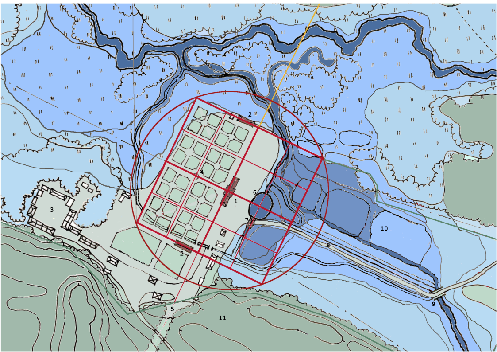

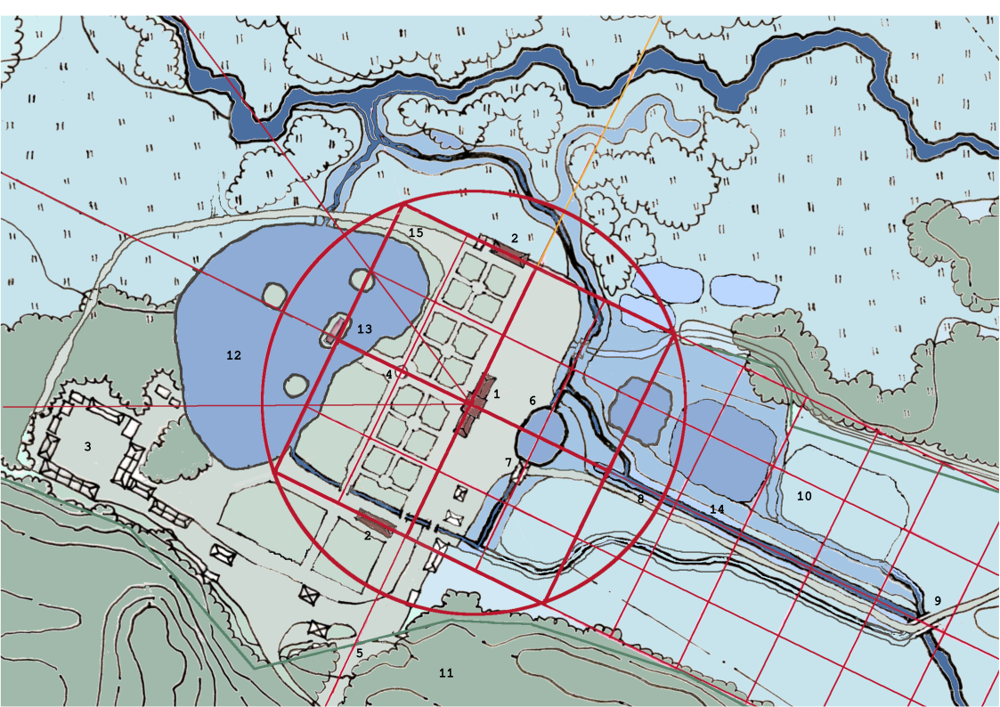

Pierwotna kompozycja oparta na wzorcu *ad quadratum* obejmowała:[^2]

1. centralną modrzewiową *willę*
2. dwie symetryczne drewniane oficyny
3. zabudowania gospodarcze
4. medianę ogrodu kwaterowego z kopcem widokowym
5. dukt leśny do ogrodów na Bukowej Górze
6. staw *villowy* przed podjazdem
7. budynek wrotnych przed dziedzińcem
8. groblę z drogą dojazdową
9. most — system zastawek
10. *zwierzyńczyk* (teren oswojonej fauny)
11. oparkaniony *zwierzyniec* z altaną widokową nad Wielkim Bagnem

Model *idealnej villi* sprawił przetrwanie kluczowych osi renesansowych przez stulecia zmian stylistycznych i funkcjonalnych — jest to najmocniejszy dowód na fundamentalne znaczenie pierwotnego geometrycznego planu.

## 2. Maniera renesansu francuskiego (poł. XVII w.)

**III ordynat — Jan II Zamoyski „Sobiepan" i [Maria Kazimiera](/zwierzyncopedia/ludzie/maria-kazimiera-zamoyska/)**

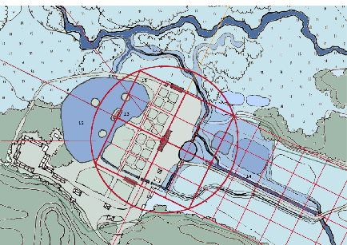

*Marysieńka* Zamoyska, przebywając wielokrotnie w Paryżu, bezpośrednio poznała wczesny Wersal i ogrody Le Nôtre'a. Pod jej wpływem główne osie zostały przedłużone, a powstały nowe — promieniste:[^3]

- **staw z czterema wyspami** — kopany rękami tureckich jeńców podarowanych Zamoyskiemu przez Jana Sobieskiego
- **ermitaż** na środkowej wyspie stawu
- **długi kanał** wzdłuż grobli dojazdowej
- **grobla *Marysieńki*** wedle stawu

**Konkluzja:** wzmocnienie kanwy *układu villowego.*

## 3. Barok włoski (poł. XVIII w.)

**VII ordynat — [Tomasz Antoni Zamoyski](/zwierzyncopedia/ludzie/tomasz-antoni-zamoyski/)**

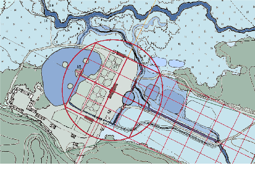

Ordynat-architekt i znawca sztuki ogrodowej dodał do założenia warstwę sakralną i ogrodową:[^4]

- **[Kościół na Wodzie](/zwierzyncopedia/dziedzictwo/architektura/kosciol-na-wodzie/)** — barokowa świątynia kontrreformacyjna wg schematu *Il Gesù* (1741–1747), wzniesiona na centralnej wyspie stawu
- **wzory kwater ogrodowych** zaprojektowane osobiście przez ordynata

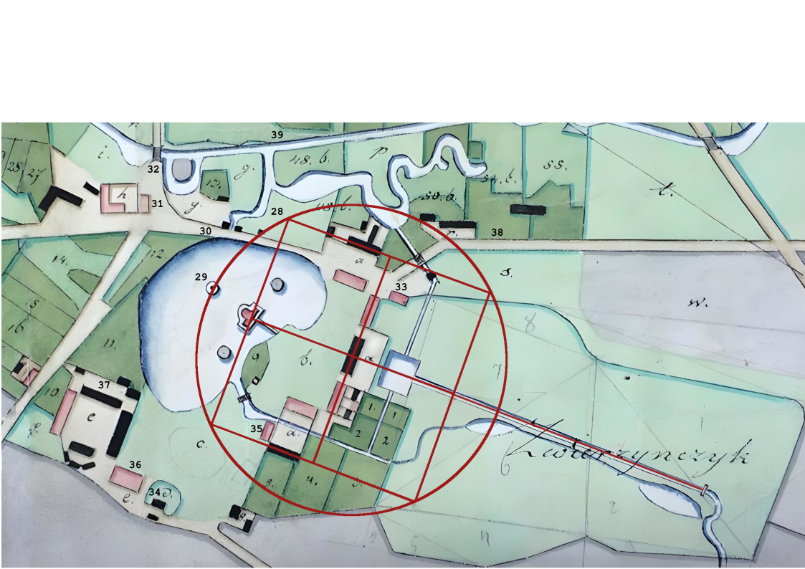

- **przeprawa brodem** na Wieprzu
- **droga na Klemensów** — nową rezydencję ordynacką

**Konkluzja:** wzmocnienie kanwy *układu villowego.*

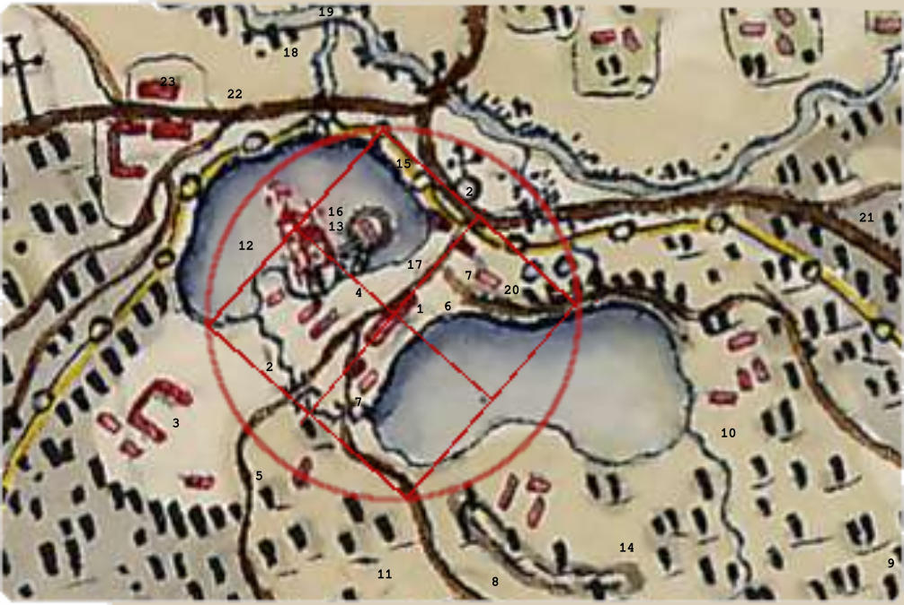

## 4. Maniera sentymentalna (koniec XVIII w.)

**XI ordynat — Aleksander August Zamoyski**

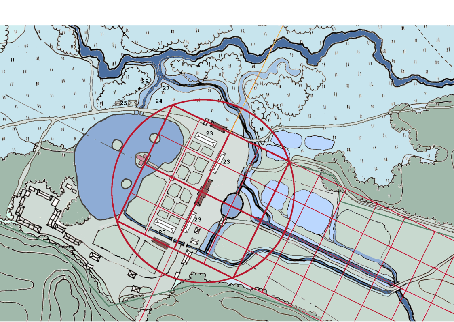

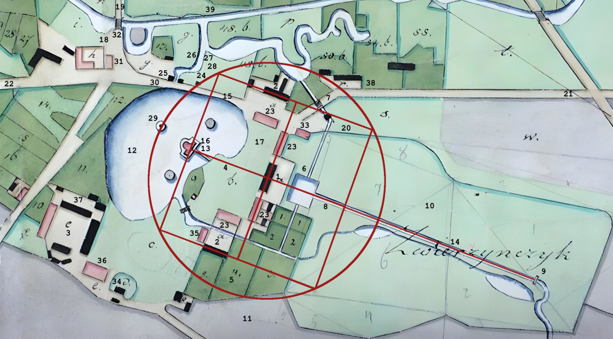

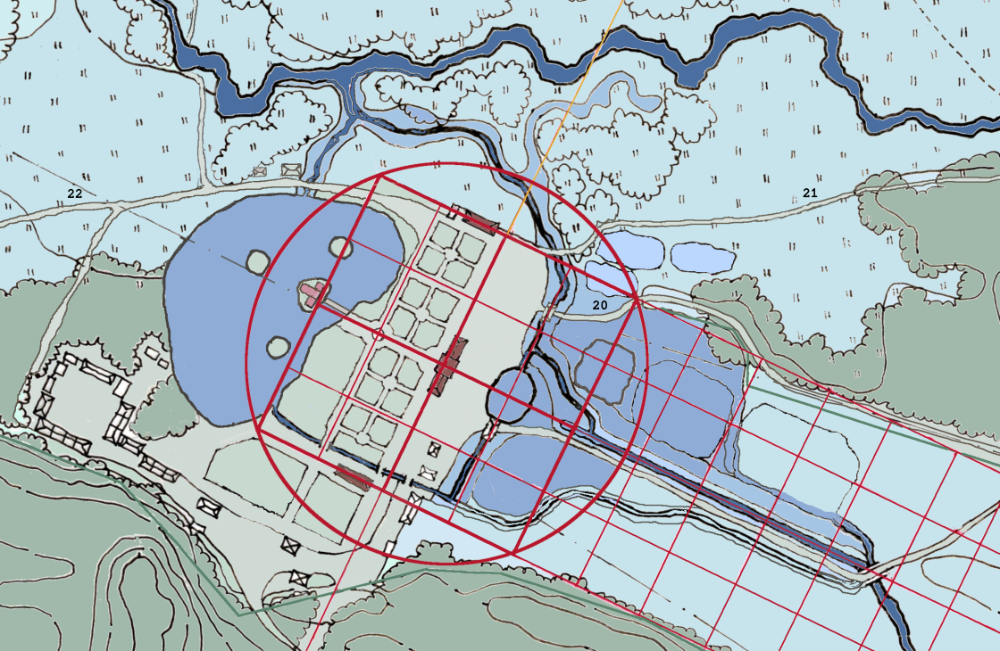

Okres wewnętrznych reform i nowej wrażliwości estetycznej:[^5]

- **cztery murowane klasycystyczne oficyny** — ustawione w podkowę wokół starej drewnianej willi
- **sentymentalny park** z kanałami wodnymi, mostkami, altanami nad [Wieprzem](/zwierzyncopedia/przyroda/rzeka-wieprz/)
- **młyn z kołem podsiębiernym** — z domkiem młynarza
- **chiński mostek** nad przelewem wody ze stawu
- *złamane* kolumny — romantyczne artefakty ogrodowe

Za tego ordynata rozpoczęto regulację koryta Wieprza — likwidację licznych zakoli rzeki.

**Konkluzja:** wzmocnienie kanwy *układu villowego.*

## 5. Ogrody „romantycznych i oświeconych" (pocz. XIX w.)

**XII ordynat — Stanisław Kostka Zamoyski** i żona **Zofia z Czartoryskich**
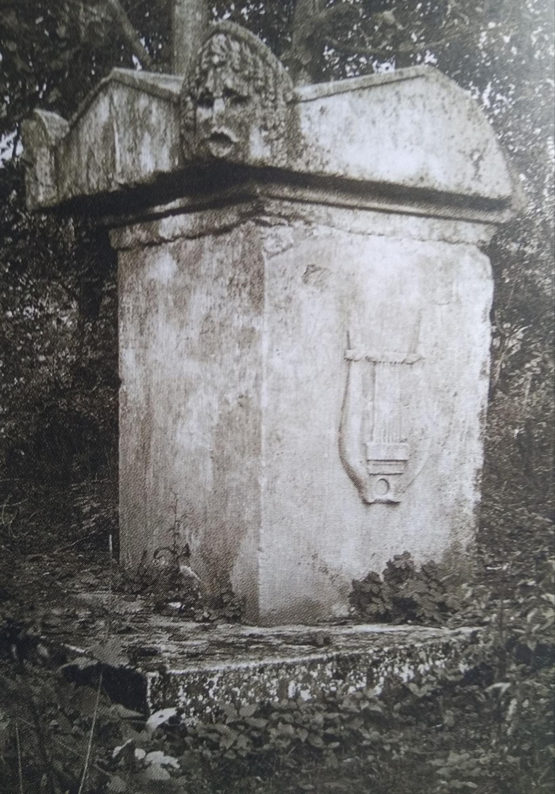
Córka Izabeli Czartoryskiej założyła ogrody romantyczne ze stylowymi artefaktami:[^6]

- **swobodne ogrody w stylu angielskim**
- *rzymski* sarkofag na wyspie topolowej (jak grobowiec Rousseau w Ermenonville)
- oko *Opatrzności Bożej*
- aleja i lipa *Marysieńki*
- chińskie mostki nad kanałami byłych meandrów Wieprza

Mapa pomiarowa z 1829–1830 r. rejestrowała pełne rozwinięcie założenia: modrzewiową willę w centrum, dwie stare drewniane oficyny, cztery nowe murowane oficyny, ogrody kwaterowe z kopcem widokowym, kanał, groble, stawy — wszystko w czytelnym porządku geometrycznym.

Były to **końcowe lata świetności** starej willi. Ostatni dokument wzmiankujący jej istnienie pochodzi z 20 września 1833 r.

**Konkluzja:** utrwalenie kanwy pierwotnego *układu villowego.*

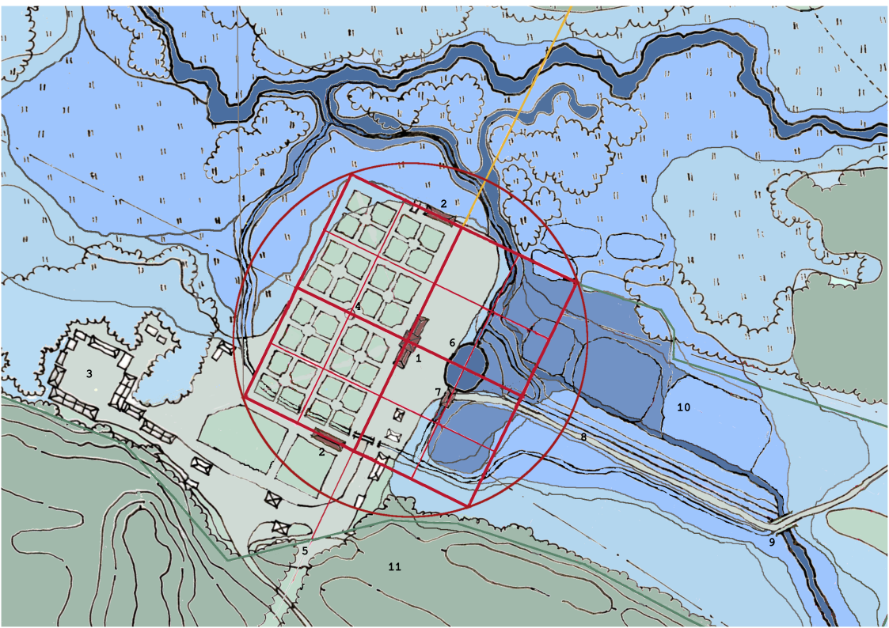

## 6. Osada urzędnicza (od ok. 1842)

**XIII ordynat — Konstanty Zamoyski**

Na [mapie z 1842 r.](/zwierzyncopedia/biblioteka/mapy-i-plany/) willi już nie ma — w jej miejscu pusta przestrzeń pomiędzy czterema murowanymi oficynami. Pojawiły się nowe elementy osady:[^7]

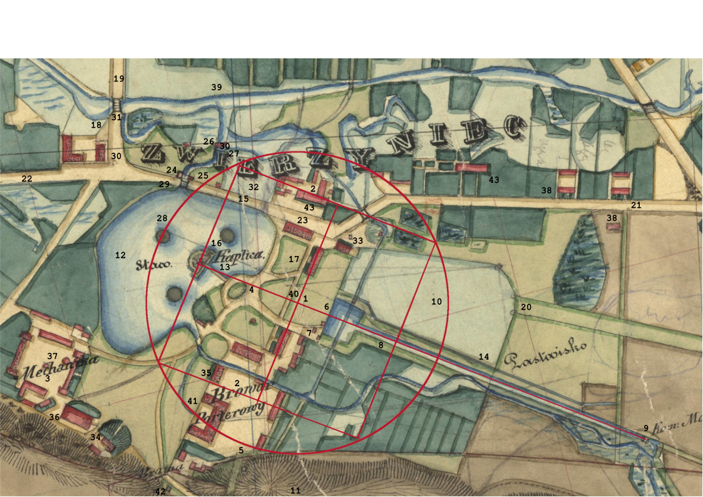

- browar
- Willa *Plenipotentówka*

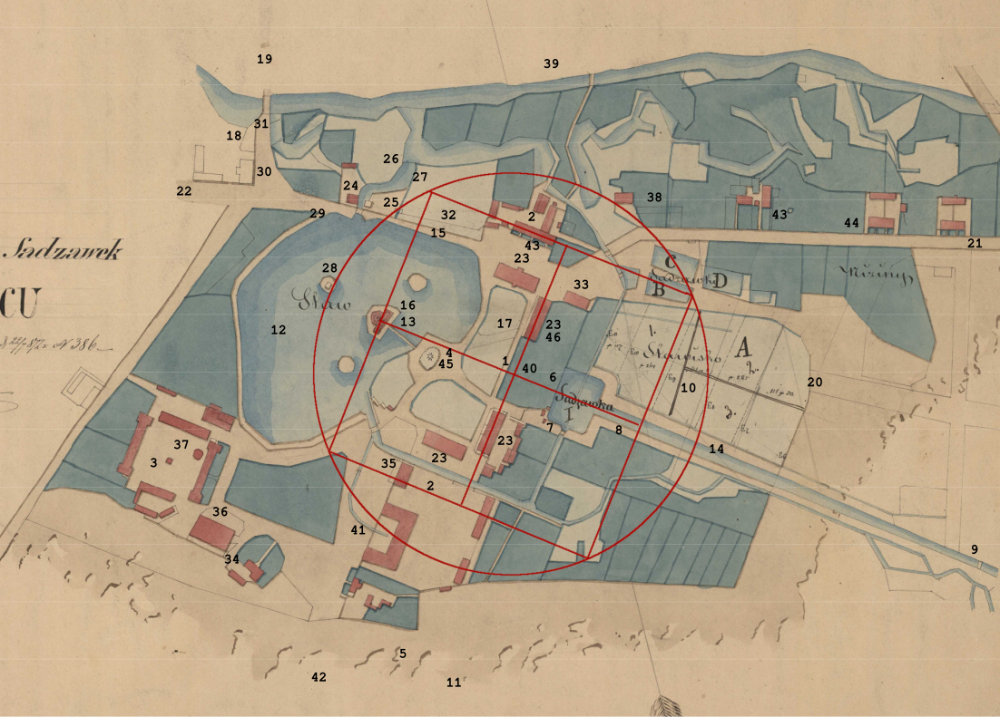

- murowane i nowe drewniane domy urzędnicze

**XIV ordynat — Tomasz Franciszek Zamoyski** nadbudował piętro jednej z oficyn, tworząc *Pałac Administracji [Ordynacji Zamojskiej](/zwierzyncopedia/dziedzictwo/architektura/zarzad-ordynacji/)*.

**Konkluzja:** przemysłowe lokalizacje i zubożenie kanwy *układu villowego* — ale zachowanie kluczowych osi kompozycyjnych.

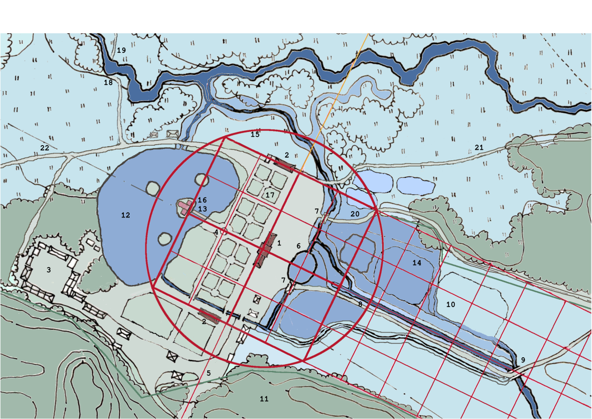

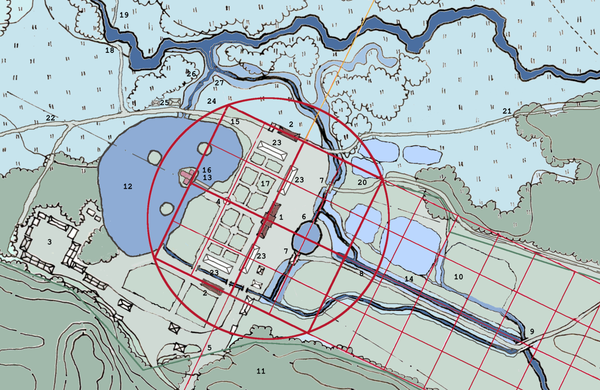

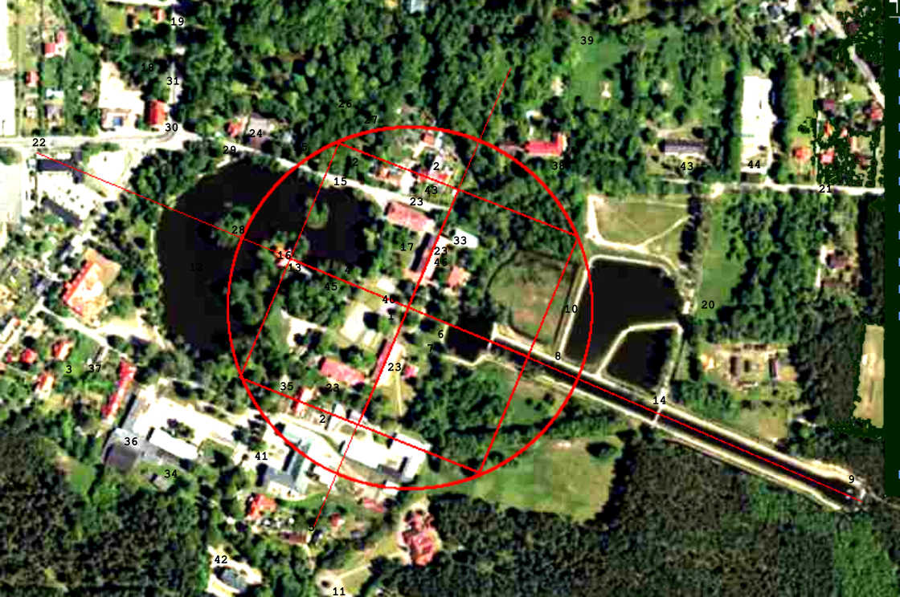

## Znaczenie palimpsestu

Ewolucja układu stanowi jeden z najmocniejszych dowodów na to, że Zwierzyniec był od początku postrzegany jako cenna, główna siedziba rodowa. Kolejne inwestycje nie byłyby realizowane wokół podrzędnego „dworku myśliwskiego". Fakt, że przez ponad 200 lat najwybitniejsi przedstawiciele rodu inwestowali w rozbudowę tego miejsca, świadczy o jego nieprzerwanej, wysokiej randze.[^8]

Zasadnicze fazy przekształceń — od renesansu idealnego po romantyzm i osadę urzędniczą — nie zniszczyły pierwotnego geometrycznego kodu. Wg autorów studium *Villa Restituta*, mapa pomiarowa z 1829 r. jest tego ostatecznym dowodem: „odcisk fantomowy pierwotnego planu, którego regularność trudno wytłumaczyć organicznym narastaniem".[^9]

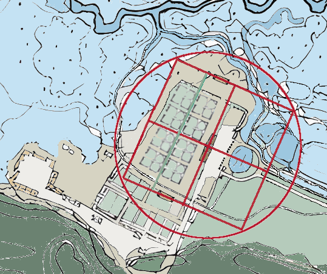

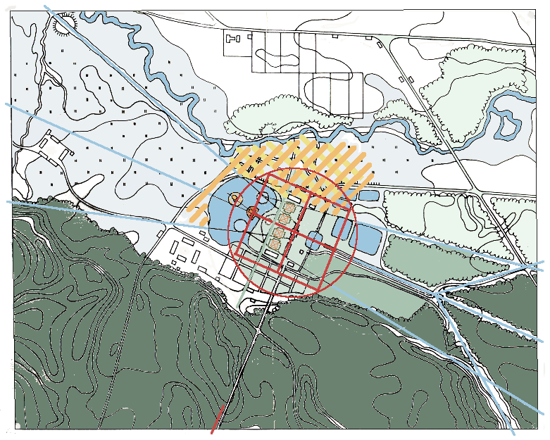

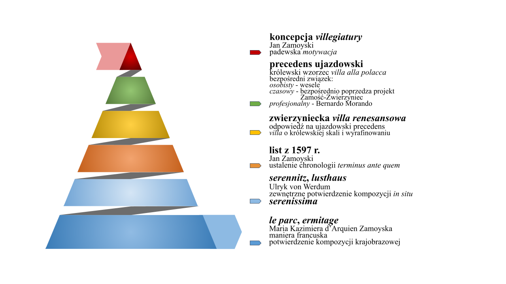

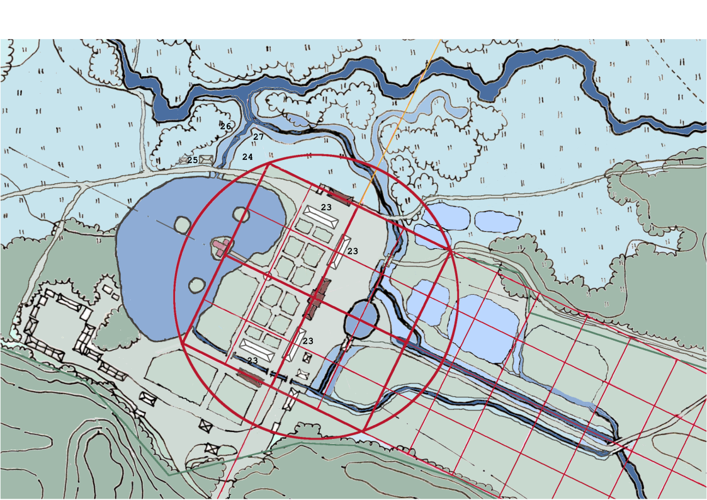

---

## Zobacz też

- [Willa Zamoyskich](/zwierzyncopedia/dziedzictwo/architektura/willa-zamoyskich/) — centralny budynek założenia
- [Osie widokowe](/zwierzyncopedia/dziedzictwo/uklad-urbanistyczny/osie-widokowe/) — geometria kompozycji *ad quadratum*
- [Mapy i plany](/zwierzyncopedia/biblioteka/mapy-i-plany/) — kartografia dokumentująca kolejne fazy
- [Ordynaci zamojscy](/zwierzyncopedia/ludzie/ordynaci-zamojscy/) — fundatorzy kolejnych warstw

[^1]: L. Matławska-Patyk, M. Patyk, *Villa Restituta w Zwierzyńcu — studium*, Zwierzyniec 2025, rozdz. VII.
[^2]: Tamże, rozdz. III i VII — model idealnej villi.
[^3]: Tamże, rozdz. VII — maniera renesansu francuskiego, III ordynat.
[^4]: Tamże, rozdz. VII — barok włoski, VII ordynat.
[^5]: Tamże, rozdz. VII — maniera sentymentalna, XI ordynat.
[^6]: Tamże, rozdz. VII — ogrody romantycznych i oświeconych, XII ordynat.
[^7]: Tamże, rozdz. VII — osada urzędnicza, XIII ordynat.
[^8]: Tamże, rozdz. IX — ocena i hierarchia wartości.
[^9]: Tamże, rozdz. VIII.4.
