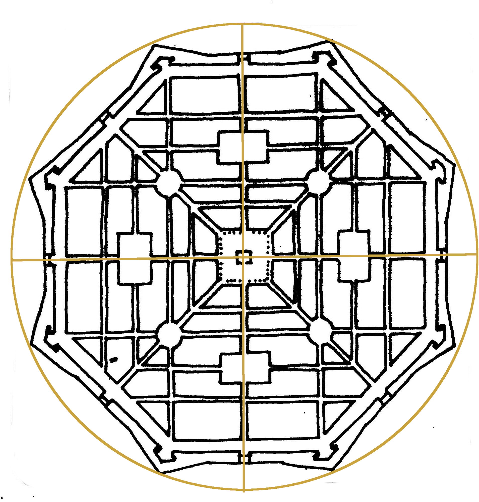

Zwierzyniec posiada unikalny historyczny układ urbanistyczny, ukształtowany przez wieki jako siedziba Ordynacji Zamojskiej. Połączenie architektury rezydencjonalnej z naturalnym krajobrazem doliny Wieprza tworzy fenomen „miasta-ogrodu".

## Hasła w tej sekcji

- [Osie widokowe](/zwierzyncopedia/dziedzictwo/uklad-urbanistyczny/osie-widokowe/)
- [System wodny](/zwierzyncopedia/dziedzictwo/uklad-urbanistyczny/system-wodny/)
- [Ogrody kwaterowe](/zwierzyncopedia/dziedzictwo/uklad-urbanistyczny/ogrody-kwaterowe/)
