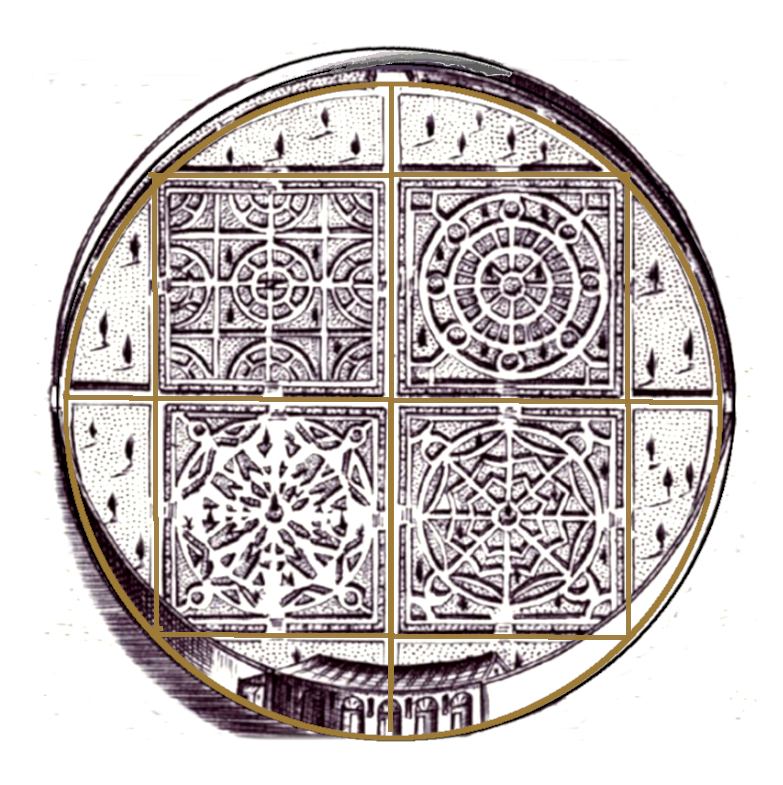
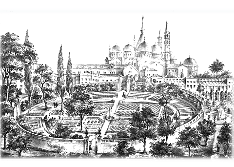
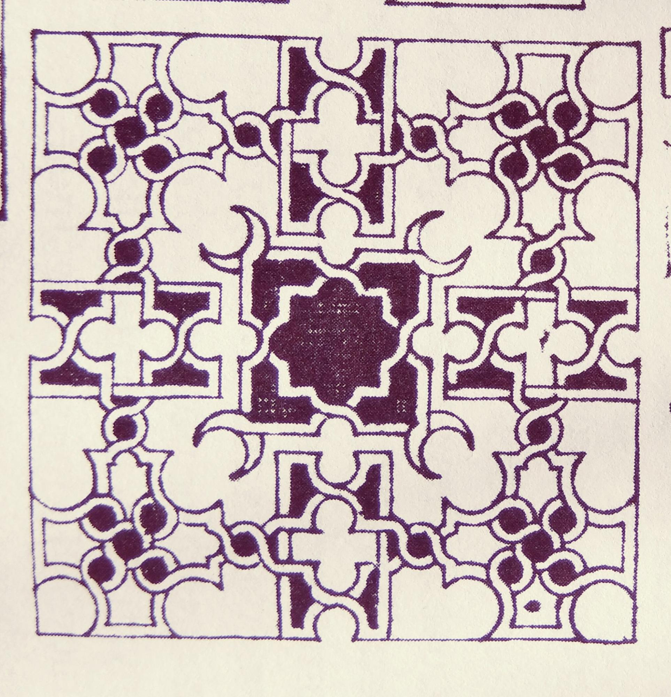
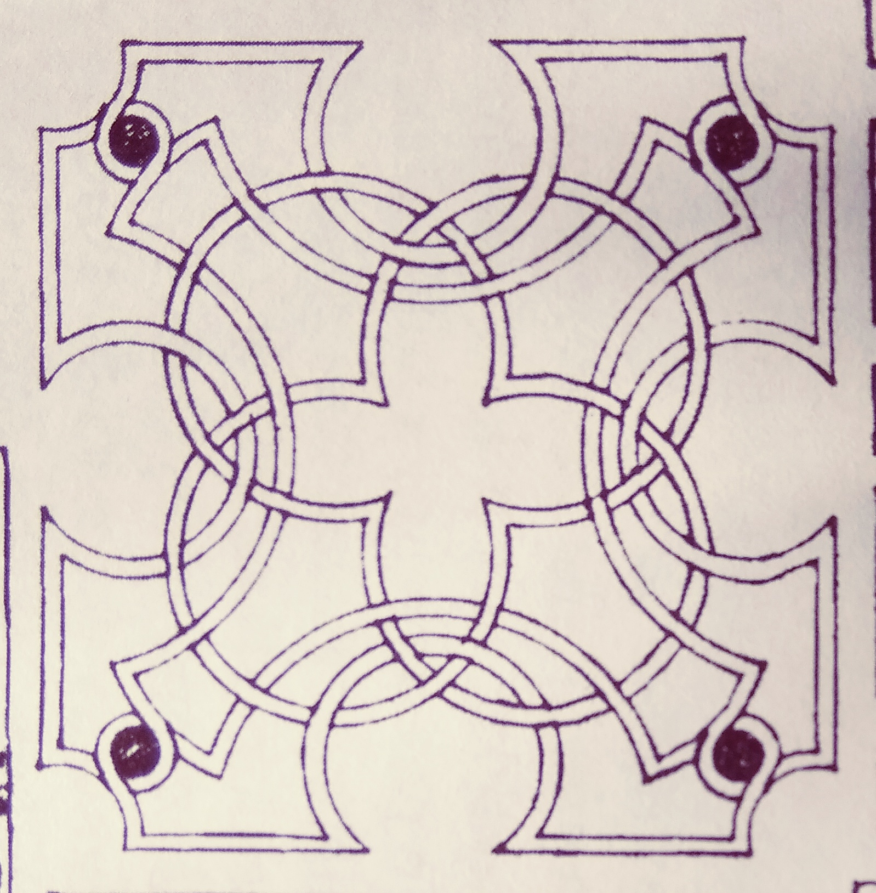
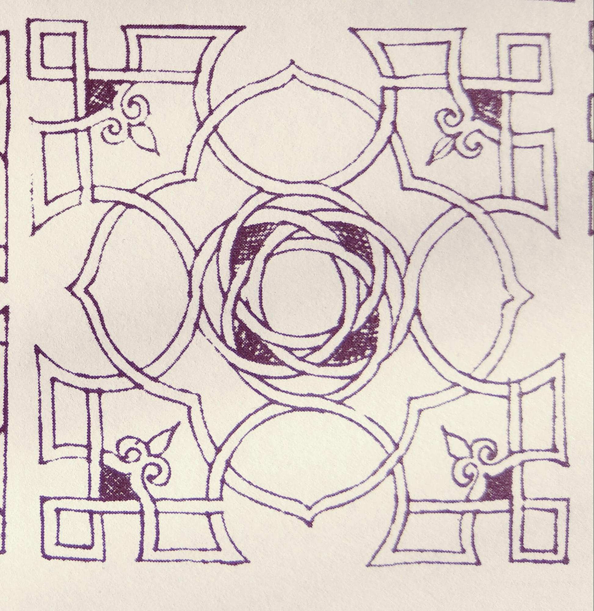

**Ogrody kwaterowe** stanowiły jeden z kluczowych elementów programowych renesansowego [założenia villowego](/zwierzyncopedia/dziedzictwo/architektura/willa-zamoyskich/) w Zwierzyńcu. Ich oś — *mediana* — przecinała prostopadle oś główną architektury willi, tworząc centralną kompozycję *ad quadratum*.[^1]

## Renesansowa kompozycja (od ok. 1593)

Centralna kompozycja *villi* została oparta na przecinających się dwóch głównych [osiach](/zwierzyncopedia/dziedzictwo/uklad-urbanistyczny/osie-widokowe/): osi *villowej* (architektury) prostopadłej do *mediany* — osi ogrodów kwaterowych. Na przecięciu obu osi wznosił się **kopiec widokowy**.[^2]

Ogrody rozciągały się po ogrodowej stronie willi (od strony zachodniej), pomiędzy odsuniętymi drewnianymi oficynami, otwarte na nadwieprzańskie błonia. Kwatery — regularne, geometryczne podziały terenu obsadzone roślinami ozdobnymi i użytkowymi — odpowiadały wzorcowi *all'italiana* znanemu z willi ujazdowskiej i krakowskich ogrodów renesansowych.[^3]

Już pierwszy ordynat [Jan Zamoyski](/zwierzyncopedia/ludzie/jan-zamoyski/) zatrudniał specjalistów ogrodników:

- **hortulanus Ambroży** — pielęgnował ogrody ordynata za pensję 70 złotych rocznie
- **Robert Hortulanus** — „przyjęty do opatrywania ogroda Staro Zamojskiego" (50 złotych rocznie)
- kolejny ogrodnik pracował w sadzie Zamoyskich przez 5 tygodni[^4]

## Rozwój za kolejnych ordynatów

Ogrody ustawicznie rozbudowywano w czterech kierunkach:[^5]

1. ku wysoczyźnie **Bukowej Góry** — ogrody w oparkanionem zwierzyńcu
2. ku wsi **Obrocz** — kanał przy grobli dojazdowej z *zwierzyńczykiem*
3. ku **nadwieprzańskim błoniom** — staw z czterema wyspami i ermitaż (*ogrody Marysieńki*)
4. ku **[rzece Wieprz](/zwierzyncopedia/przyroda/rzeka-wieprz/)** — sentymentalne ogrody Zofii Zamoyskiej

Za III ordynata sprowadzono z Włoch ogrodnika **Jakuba Gerharda** (wcześniej zatrudnionego w królewskim Łobzowie krakowskim), który od 1652 r. wraz z Mateuszem Pawlikiem tworzył ogrody w Zamościu i z pewnością pielęgnował również kwatery zwierzynieckie.[^6]

## Dzieło *Ogrodnictwo* — Tomasz Antoni Zamoyski

VII ordynat [Tomasz Antoni Zamoyski](/zwierzyncopedia/ludzie/tomasz-antoni-zamoyski/) (1707–1752) — architekt-amator i fundator [Kościoła na Wodzie](/zwierzyncopedia/dziedzictwo/architektura/kosciol-na-wodzie/) — był autorem niedokończonego dzieła pt. *Ogrodnictwo*, które wg opinii prof. Jerzego Kowalczyka jest **pierwszym polskim traktatem o sztuce ogrodowej**. Dzieło zawierało projekty kwater ogrodowych, które ordynat rysował osobiście.[^7]

Żona ordynata, **Teresa Aniela z Michowskich**, nadzorowała prace ogrodowe w Zwierzyńcu i Klemensowie. W 1745 r. wydała dyspozycję burgrabemu zamojskiemu: *„trzeba będzie ulice szpetce jakem się już z Was Panem rozmuwiła (...) ludzi do Ogrodu włoskiego, którzy zasadzają lipiną przynajmować..."*[^8]

## Zaawansowana kultura ogrodowa w XVIII wieku

Za IX ordynata Jan Jakuba Zamoyskiego kultura ogrodowa osiągnęła szczyt wyrafinowania:[^9]

- wieloletni ogrodnik **Jan Ziomka** (1761–1792) z trzema pomocnikami, pensja 864 złote rocznie — mieszkał w oddzielnym domku ogrodnika
- **dwa ogrody**: ozdobny i kuchenny, każdy otoczony 100-przęsłowym płotem
- **oranżeria** i **inspekty** z ciepłolubnymi krzewami i kwiatami, wynoszonymi latem do ogrodu w ceramicznych i drewnianych donicach malowanych grynszpanem

*Protokół pomiarowy gromady zwierzynieckiej z 1787 r.* wymienia m.in. „pałac wśród ogrodów przy sadzawce", „oranżerię", „ogród włoski".[^10]

## Kopiec widokowy — relikt ogrodów

Ogrodowy **kopiec widokowy** — typowy element ogrodu kwaterowego, z którego podziwiało się symetrię założenia — wzniesiony pośród ozdobnych kwater istniał jeszcze w 1872 r. (plan L. Doranta). Jego lokalizacja na przecięciu osi *villowej* i *mediany* stanowi kartograficzny dowód na istnienie regularnego, planowego ogrodu renesansowego.[^11]

Współczesna **ulica Browarna** w Zwierzyńcu przebiega wzdłuż dawnej *mediany* ogrodów kwaterowych — ślad renesansowej osi zachowany w miejskim układzie komunikacyjnym.

---

## Zobacz też

- [Osie widokowe](/zwierzyncopedia/dziedzictwo/uklad-urbanistyczny/osie-widokowe/) — geometria *ad quadratum* i oś mediany
- [Palimpsest — ewolucja założenia](/zwierzyncopedia/dziedzictwo/palimpsest/) — fazy stylowe ogrodów
- [Willa Zamoyskich](/zwierzyncopedia/dziedzictwo/architektura/willa-zamoyskich/) — centralny budynek, wokół którego zakomponowano ogrody
- [Mapy i plany](/zwierzyncopedia/biblioteka/mapy-i-plany/) — kartografia rejestrująca kwatery

[^1]: L. Matławska-Patyk, M. Patyk, *Villa Restituta w Zwierzyńcu — studium*, Zwierzyniec 2025, rozdz. III.2.
[^2]: Tamże; kopiec widokowy na przecięciu osi villowej i mediany.
[^3]: Tamże, rozdz. I.5 — elementy programowe villi.
[^4]: AOZ, rachunki z 1596 r.: Ambroży Hortulanus, Robert Hortulanus; za: *Villa Restituta*, rozdz. III.2.
[^5]: L. Matławska-Patyk, M. Patyk, *Villa Restituta…*, rozdz. III.2.
[^6]: Tamże; J. Gerhard sprowadzony z włoskiego Łobzowa krakowskiego w 1652 r.
[^7]: Tamże, rozdz. IV (VII ordynat); J. Kowalczyk o dziele *Ogrodnictwo*.
[^8]: AOZ, korespondencja Teresy Anieli Zamoyskiej z burgrabim P. Blumbergiem, 1745 r.
[^9]: L. Matławska-Patyk, M. Patyk, *Villa Restituta…*, rozdz. IV (IX ordynat).
[^10]: Protokół pomiarowy gromady zwierzynieckiej z 1787 r., za: *Villa Restituta*.
[^11]: AP Lublin, Plan L. Doranta, 1872 r.; *Villa Restituta*, rozdz. VII.
