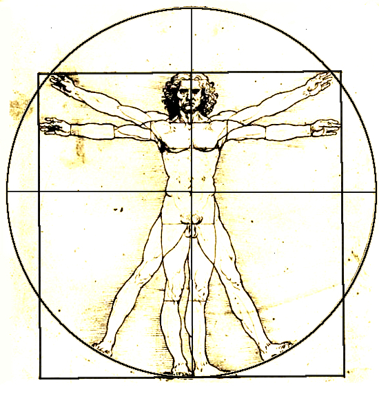
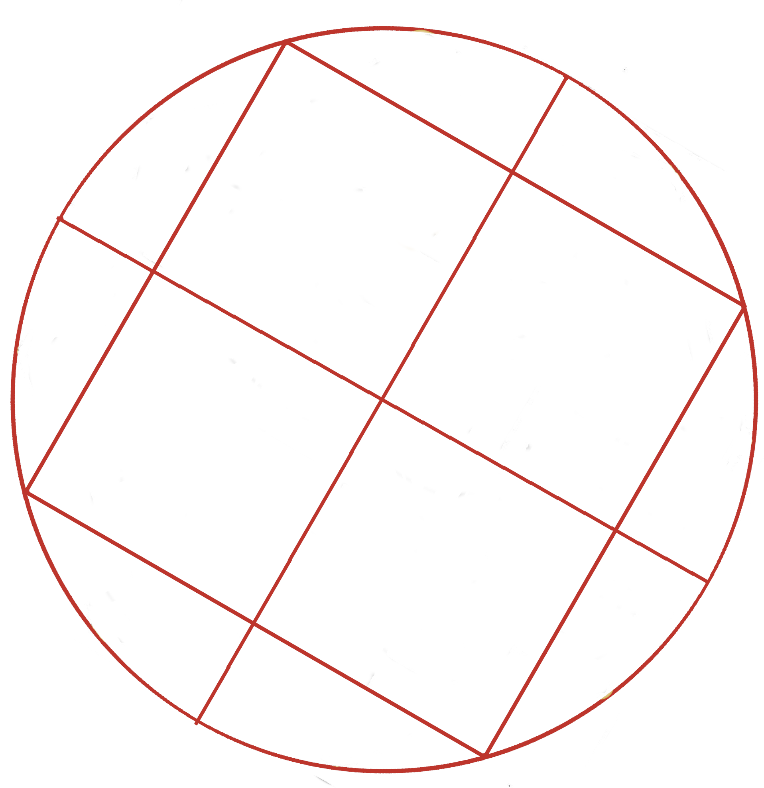
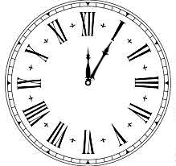
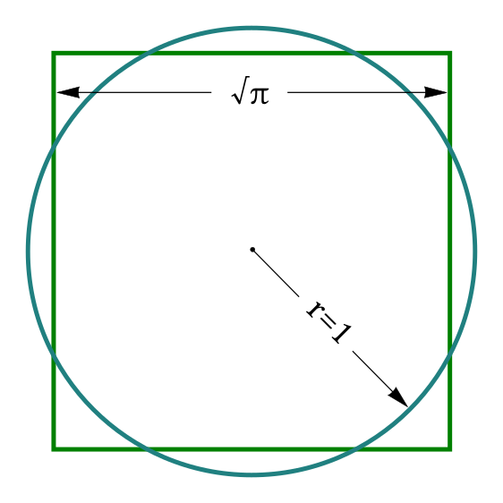
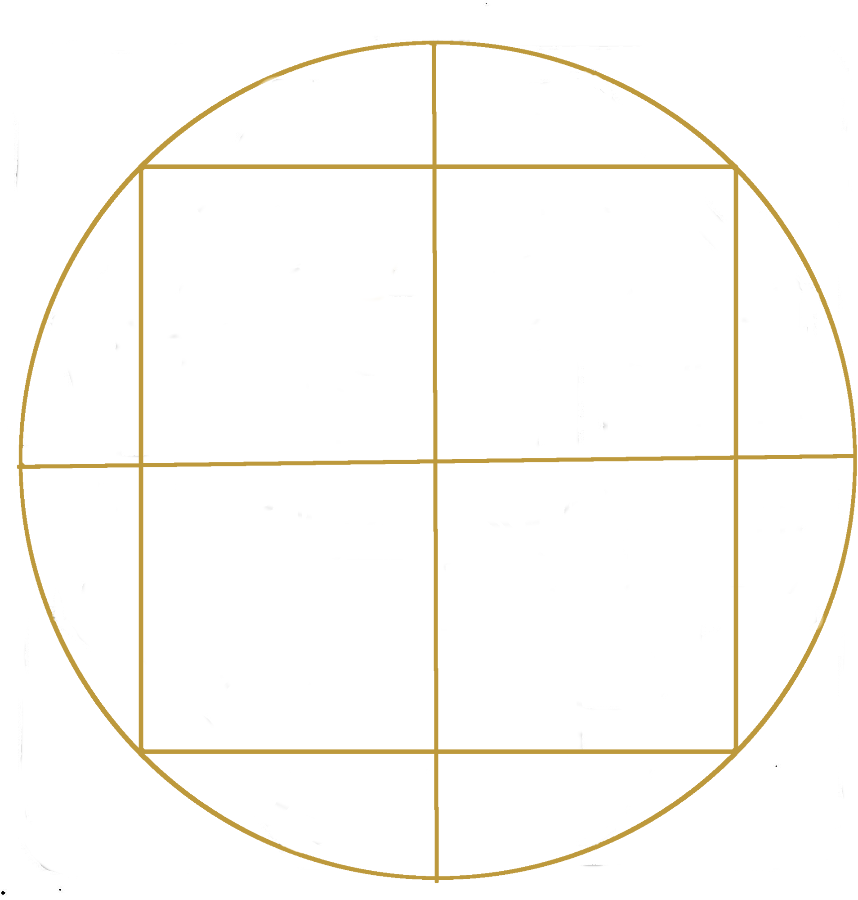
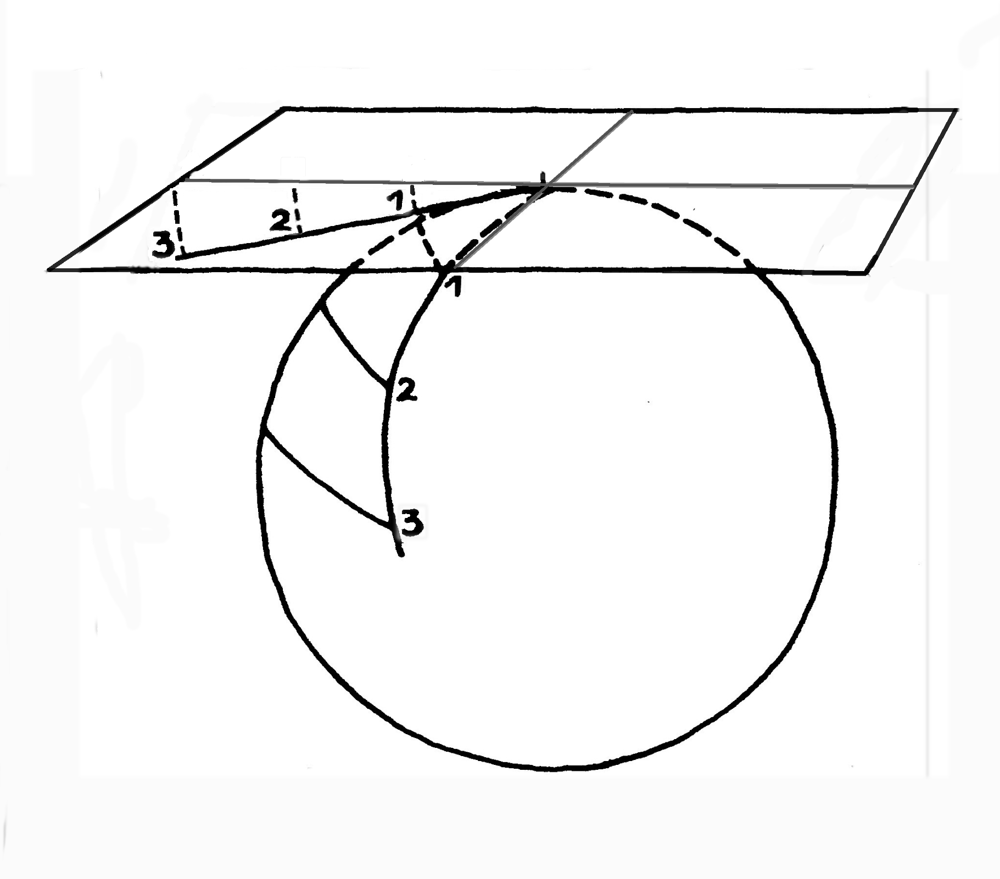
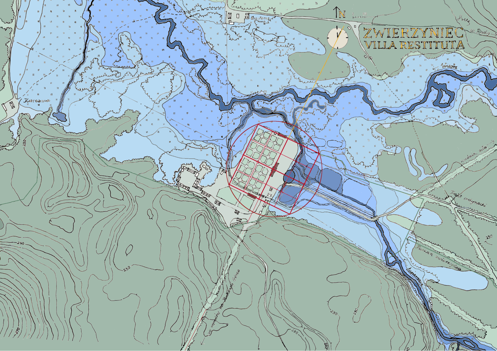
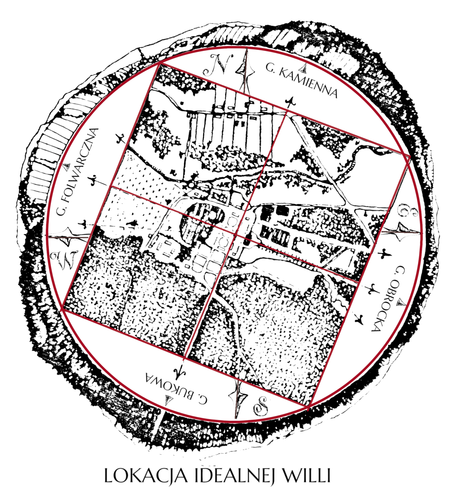
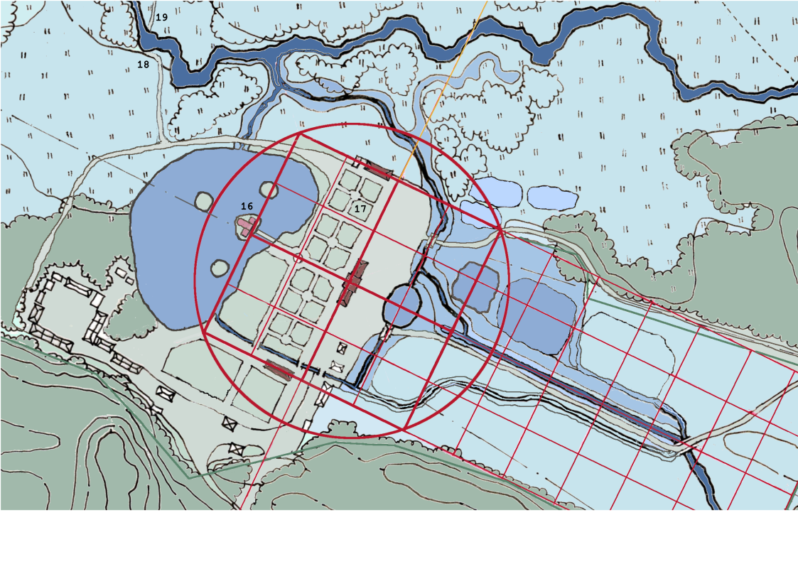
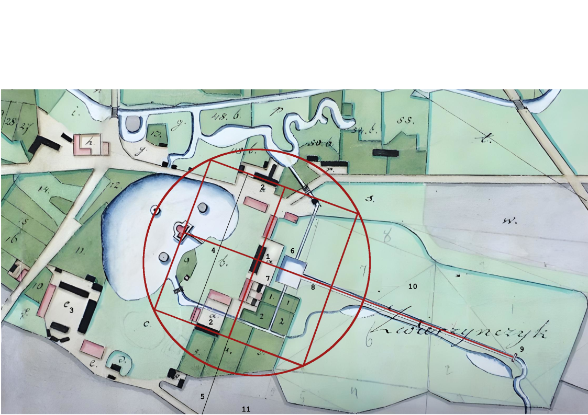

**Osie widokowe** Zwierzyńca — system renesansowych osi kompozycyjnych wytyczonych przy zakładaniu [willi Zamoyskich](/zwierzyncopedia/dziedzictwo/architektura/willa-zamoyskich/) ok. 1593 roku, łączących centralny budynek z otoczeniem krajobrazowym pradoliny rzeki Wieprz. Według hipotetycznej rekonstrukcji Lucyny Matławskiej-Patyk i Michała Patyka stanowiły integralną część idealnego modelu geometrycznego *villi*.[^1]

## Renesansowy model geometryczny

Na teren przyszłej willi nałożono trzy nakładające się figury geometryczne — tę samą zasadę kompozycyjną, którą Jerzy Kowalczyk wykazał w odniesieniu do planu Zamościa:

| Figura | Funkcja | Znaczenie |
|--------|---------|-----------|
| **Krzyż grecki** | Orientacja względem stron świata | Zorientowany *„pięć na trzynastą"* — 30° na wschód od osi północ–południe, co zapewniało optymalne nasłonecznienie i przewietrzanie *podług nieba polskiego* |
| **Kwadrat** | Pole gruntu | Miara liniowa modułu i budynku centralnego |
| **Koło** | Widnokrąg krajobrazowy | Miara kątowa kierunków osi widokowych i duktów leśnych |

Zastosowanie idealnych figur geometrycznych było projektem stworzenia ziemskiego mikrokosmosu, w którym panuje doskonały porządek — zarówno w sferze społecznej (*respublica*), jak i naturalnej (*natura naturans*).[^2]

## Główne osie

### Oś główna architektury

Prostopadła do grzbietu wydmowego, łączyła front willi z dziedzińcem podjazdowym i stawem villowym. Po drugiej stronie — otwarcie na ogrody i błonia nad rzeką Wieprz.[^3]

### Mediana ogrodowa

Oś ogrodów kwaterowych *ad quadratum*, biegnąca prostopadle do osi głównej. Łączyła willę z odległymi ogrodami na Bukowej Górze poprzez dukt leśny — zachowany w terenie do dziś. Kopiec widokowy wzniesiony pośród ozdobnych kwater, jeszcze zaznaczony na planie z 1872 roku, wyznaczał punkt centrujący mediany.[^4]

### Osie promieniste (XVII wiek)

Za III ordynata *Sobiepana* i [Marysieńki](/zwierzyncopedia/ludzie/maria-kazimiera-zamoyska/) główne osie zostały przedłużone, a do układu dodano nowe, promieniste — w stylu maniery renesansu francuskiego. Długi kanał wzdłuż grobli dojazdowej wzmocnił oś podjazdową; staw z wyspami i ermitażem stworzył nowy punkt widokowy.[^5]

## Wnętrze krajobrazowe

[Jan Zamoyski](/zwierzyncopedia/ludzie/jan-zamoyski/) wybrał lokację w rozległej pradolinie rzeki Wieprz, okolonej wzgórzami tworzącymi naturalne zamknięcie widokowe:

- **Bukowa Góra** — na południowym zachodzie, domknięcie mediany ogrodowej
- **Kamienna Góra** — na północnym wschodzie
- **Obrocka Góra** — punkt widokowy, z którego ordynat podziwiał szerokie otwarcie pradoliny
- **Folwarczna Góra** — na południowym wschodzie

Otoczenie krajobrazowe wnętrza — dno doliny zamknięte wzgórzami — powiązano kompozycyjnie osiami widokowymi, tworząc panoramiczne wnętrze architektoniczno-krajobrazowe. Profesor Szymon Szymonowic w *Sielankach* opisywał ten ideał: *Ideałem staje się rozległa przewiewna dolina otoczona wzniesieniami.*[^6]

## Orientacja „pięć na trzynastą"

Oś główna układu villowego nie jest zorientowana zgodnie ze stronami świata — jest obrócona o ok. 30° na wschód od osi północ–południe. L. Matławska-Patyk i M. Patyk określają tę orientację metaforą „pięć na trzynastą" (kierunek wg tarczy zegara). Było to świadome rozwiązanie projektowe *podług nieba i zwyczaju polskiego*, zapewniające optymalne nasłonecznienie pomieszczeń willi i ogrodów kwaterowych oraz właściwe przewietrzanie.[^8]

Geometryczny *kod* czytelny jest w terenie do dziś, co stanowi jeden z najsilniejszych argumentów za celowością i perfekcją pierwotnego projektu.

## Trwałość kompozycji

Model *idealnej villi* sprawił przetrwanie kluczowych osi renesansowych przez stulecia zmian stylistycznych — od renesansu francuskiego, przez barok, klasycyzm, po romantyzm. Każda kolejna warstwa stylowa wzmacniała, a nie zacierała pierwotną kanwę geometryczną. Jest to najmocniejszy fizyczny dowód na fundamentalne znaczenie pierwotnego planu.[^7]

---

## Zobacz też

- [Palimpsest — ewolucja założenia](/zwierzyncopedia/dziedzictwo/palimpsest/) — warstwy stylowe nakładane na geometryczną kanwę
- [Ogrody kwaterowe](/zwierzyncopedia/dziedzictwo/uklad-urbanistyczny/ogrody-kwaterowe/) — kwatery *ad quadratum* na osi mediany
- [Pomnik Historii — argumentacja](/zwierzyncopedia/dziedzictwo/pomnik-historii/) — waloryzacja wnętrz WAK 1–5
- [Mapy i plany](/zwierzyncopedia/biblioteka/mapy-i-plany/) — źródła kartograficzne dokumentujące osie

[^1]: L. Matławska-Patyk, M. Patyk, *Villa Restituta w Zwierzyńcu. Studium*, Zwierzyniec 2025, cz. III.1.
[^2]: Villa Restituta, cz. III.1; J. Kowalczyk, *Ideologiczne aspekty urbanistyki Zamościa*.
[^3]: Villa Restituta, cz. III.1 — hipotetyczna rekonstrukcja.
[^4]: Villa Restituta, cz. III.2; AP Lublin, Plan stawu…, L. Dorant, 1872 r.
[^5]: Villa Restituta, cz. IV (III ordynat) — hipotetyczna rekonstrukcja maniery renesansu francuskiego.
[^6]: Sz. Szymonowic, *Sielanki*, za: Villa Restituta, cz. III.1.
[^7]: Villa Restituta, cz. VII — Zwierzyniec jako palimpsest.
[^8]: Villa Restituta, cz. VIII — analiza orientacji; cz. III.1.
