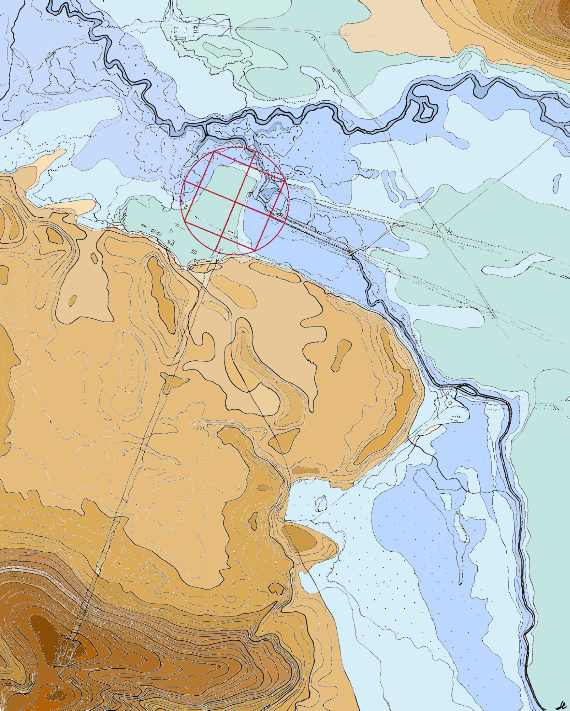

**Wieprz** — rzeka przepływająca przez Zwierzyniec, której pradolina stanowiła naturalne tło i warunek lokacji renesansowego [założenia villowego](/zwierzyncopedia/dziedzictwo/architektura/willa-zamoyskich/) [Jana Zamoyskiego](/zwierzyncopedia/ludzie/jan-zamoyski/).

## Pradolina — wybór miejsca

[Jan Zamoyski](/zwierzyncopedia/ludzie/jan-zamoyski/), spoglądając z Obrockiej Góry, podziwiał szerokie otwarcie pradoliny Wieprza okolonej wzgórzami: Bukową Górą, Kamienną Górą, Obrocką Górą i Folwarczną Górą. Na *założenie villowe* wybrał lekkie wzniesienie piaszczystego *plateau* po lewej stronie rzeki, naturalnie niedostępne przez rozlewiska i bagna.[^1]

Zalewowe bagna pradoliny Wieprza czyniły siedzibę bezpieczną — tak jak *Duża i Mała Zalewa* chroniły Zamość. Utworzony na kanwie naturalnych cieków [układ wodny](/zwierzyncopedia/dziedzictwo/uklad-urbanistyczny/system-wodny/) wzmocnił ochronę drewnianej zabudowy, dzięki czemu trwała pomyślnie blisko 250 lat.[^1]

## Rola w założeniu villowym

W programie renesansowej *villi* rzeka pełniła kilka funkcji:

- **obronna** — rozlewiska i bagna stanowiły naturalną barierę, utrudniającą dostęp do drewnianej willi
- **krajobrazowa** — pradolina tworzyła wnętrze krajobrazowe założenia (*theatrum naturae*), otwarte widokowo na otaczające wzgórza
- **wodna** — zasilała system stawów, kanałów i grobli, w tym staw z czterema wyspami (na którego centralnej wyspie stanął [Kościół na Wodzie](/zwierzyncopedia/dziedzictwo/architektura/kosciol-na-wodzie/))
- **komunikacyjna** — bród na Wieprzu stanowił przeprawę łączącą villę z drogą na Klemensów

W epoce sentymentalnej (XVIII–XIX w.) nad Wieprzem zaaranżowano *park sentymentalny* z kanałami wodnymi, mostkami i altanami. W lecie gondolami pływano po wodach pałacowego stawu, kanałem i nurtem [Świerszcza](/zwierzyncopedia/przyroda/stawy-echo/) aż w głąb lasu po Malowany Most.[^2]

## Regulacja koryta

Za XI ordynata Aleksandra Augusta Zamoyskiego (2. poł. XVIII w.) rozpoczęto likwidację licznych zakoli rzeki.[^3] Prace kontynuował XII ordynat Stanisław Kostka Zamoyski, który dokończył prostowanie koryta Wieprza. Pozostawione meandry wykorzystano w aranżacji parku nad rzeką — chińskie mostki przerzucano nad dawnymi kanałami byłych meandrów, a żona ordynata Zofia z Czartoryskich, córka Izabeli, zakładała wśród nich ogrody romantyczne.[^4]

Po regulacji rzeka otrzymała numer 39 na mapie pomiarowej z 1829–1830 r. jako jeden z elementów ewolucji założenia — już nie naturalny meandrujący strumień, lecz skanalizowany fragment kompozycji krajobrazowej.

## Współcześnie

Wieprz w Zwierzyńcu tworzy charakterystyczną pętlę obejmującą centrum miejscowości. Rzeka pozostaje osią krajobrazową Zwierzyńca i ważnym elementem ekosystemu — jej dolina jest objęta otuliną Roztoczańskiego Parku Narodowego.

---

## Zobacz też

- [System wodny](/zwierzyncopedia/dziedzictwo/uklad-urbanistyczny/system-wodny/) — historyczne kanały, groble i stawy
- [Stawy Echo](/zwierzyncopedia/przyroda/stawy-echo/) — kompleks stawów na Świerszczu
- [Park środowiskowy](/zwierzyncopedia/przyroda/park-srodowiskowy/) — park w pętli Wieprza

[^1]: L. Matławska-Patyk, M. Patyk, *Villa Restituta w Zwierzyńcu — studium*, Zwierzyniec 2025, rozdz. III.1.
[^2]: H. Matławska, L. Matławska-Patyk, M. Patyk, *Idea jedności człowieka z przyrodą w Zwierzyńcu — ogrodzie oświeconych i romantycznych*, Teka KUiA, T. XXIII, 1989.
[^3]: L. Matławska-Patyk, M. Patyk, *Villa Restituta…*, rozdz. VII — maniera sentymentalna, XI ordynat.
[^4]: Tamże, XII ordynat Stanisław Kostka Zamoyski; H. Matławska, *Zwierzyniec*, Zwierzyniec 1991.
